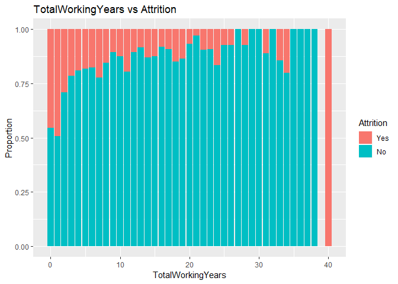

### Load Libraries

```r
#install.packages("data.table")
#install.packages("readxl")
#install.packages("ggplot2")
#install.packages("reshape")
#install.packages("pander")
library("pander")
library("data.table")
library("readxl")
library("ggplot2")
library("reshape")
```

```
## 
## Attaching package: 'reshape'
```

```
## The following object is masked from 'package:data.table':
## 
##     melt
```
### Reproducibility: Session Info

```r
sessionInfo()
```

```
## R version 3.5.0 (2018-04-23)
## Platform: x86_64-apple-darwin15.6.0 (64-bit)
## Running under: macOS High Sierra 10.13.6
## 
## Matrix products: default
## BLAS: /Library/Frameworks/R.framework/Versions/3.5/Resources/lib/libRblas.0.dylib
## LAPACK: /Library/Frameworks/R.framework/Versions/3.5/Resources/lib/libRlapack.dylib
## 
## locale:
## [1] en_US.UTF-8/en_US.UTF-8/en_US.UTF-8/C/en_US.UTF-8/en_US.UTF-8
## 
## attached base packages:
## [1] stats     graphics  grDevices utils     datasets  methods   base     
## 
## other attached packages:
## [1] reshape_0.8.8     ggplot2_2.2.1     readxl_1.1.0      data.table_1.11.4
## [5] pander_0.6.3     
## 
## loaded via a namespace (and not attached):
##  [1] Rcpp_1.0.0       knitr_1.20       magrittr_1.5     munsell_0.4.3   
##  [5] colorspace_1.3-2 rlang_0.2.0      stringr_1.3.0    plyr_1.8.4      
##  [9] tools_3.5.0      grid_3.5.0       gtable_0.2.0     htmltools_0.3.6 
## [13] yaml_2.2.0       lazyeval_0.2.1   rprojroot_1.3-2  digest_0.6.18   
## [17] tibble_1.4.2     evaluate_0.11    rmarkdown_1.10   stringi_1.2.2   
## [21] pillar_1.2.2     compiler_3.5.0   cellranger_1.1.0 scales_0.5.0    
## [25] backports_1.1.2
```
### Load Data

```r
casedata=data.table::as.data.table(readxl::read_excel("~/MSDS-6306-Second-Case-Study/Data/CaseStudy2-data.xlsx"))
save(casedata,file="~/MSDS-6306-Second-Case-Study/Data/CaseStudy2-data.RData")
load("~/MSDS-6306-Second-Case-Study/Data/CaseStudy2-data.RData")
dim(casedata)
```

```
## [1] 1470   35
```

```r
str(casedata)
```

```
## Classes 'data.table' and 'data.frame':	1470 obs. of  35 variables:
##  $ Age                     : num  41 49 37 33 27 32 59 30 38 36 ...
##  $ Attrition               : chr  "Yes" "No" "Yes" "No" ...
##  $ BusinessTravel          : chr  "Travel_Rarely" "Travel_Frequently" "Travel_Rarely" "Travel_Frequently" ...
##  $ DailyRate               : num  1102 279 1373 1392 591 ...
##  $ Department              : chr  "Sales" "Research & Development" "Research & Development" "Research & Development" ...
##  $ DistanceFromHome        : num  1 8 2 3 2 2 3 24 23 27 ...
##  $ Education               : num  2 1 2 4 1 2 3 1 3 3 ...
##  $ EducationField          : chr  "Life Sciences" "Life Sciences" "Other" "Life Sciences" ...
##  $ EmployeeCount           : num  1 1 1 1 1 1 1 1 1 1 ...
##  $ EmployeeNumber          : num  1 2 4 5 7 8 10 11 12 13 ...
##  $ EnvironmentSatisfaction : num  2 3 4 4 1 4 3 4 4 3 ...
##  $ Gender                  : chr  "Female" "Male" "Male" "Female" ...
##  $ HourlyRate              : num  94 61 92 56 40 79 81 67 44 94 ...
##  $ JobInvolvement          : num  3 2 2 3 3 3 4 3 2 3 ...
##  $ JobLevel                : num  2 2 1 1 1 1 1 1 3 2 ...
##  $ JobRole                 : chr  "Sales Executive" "Research Scientist" "Laboratory Technician" "Research Scientist" ...
##  $ JobSatisfaction         : num  4 2 3 3 2 4 1 3 3 3 ...
##  $ MaritalStatus           : chr  "Single" "Married" "Single" "Married" ...
##  $ MonthlyIncome           : num  5993 5130 2090 2909 3468 ...
##  $ MonthlyRate             : num  19479 24907 2396 23159 16632 ...
##  $ NumCompaniesWorked      : num  8 1 6 1 9 0 4 1 0 6 ...
##  $ Over18                  : chr  "Y" "Y" "Y" "Y" ...
##  $ OverTime                : chr  "Yes" "No" "Yes" "Yes" ...
##  $ PercentSalaryHike       : num  11 23 15 11 12 13 20 22 21 13 ...
##  $ PerformanceRating       : num  3 4 3 3 3 3 4 4 4 3 ...
##  $ RelationshipSatisfaction: num  1 4 2 3 4 3 1 2 2 2 ...
##  $ StandardHours           : num  80 80 80 80 80 80 80 80 80 80 ...
##  $ StockOptionLevel        : num  0 1 0 0 1 0 3 1 0 2 ...
##  $ TotalWorkingYears       : num  8 10 7 8 6 8 12 1 10 17 ...
##  $ TrainingTimesLastYear   : num  0 3 3 3 3 2 3 2 2 3 ...
##  $ WorkLifeBalance         : num  1 3 3 3 3 2 2 3 3 2 ...
##  $ YearsAtCompany          : num  6 10 0 8 2 7 1 1 9 7 ...
##  $ YearsInCurrentRole      : num  4 7 0 7 2 7 0 0 7 7 ...
##  $ YearsSinceLastPromotion : num  0 1 0 3 2 3 0 0 1 7 ...
##  $ YearsWithCurrManager    : num  5 7 0 0 2 6 0 0 8 7 ...
##  - attr(*, ".internal.selfref")=<externalptr>
```
### Detect and Delete Non-Relevant Data

```r
cns=c()
for (cn in colnames(casedata)){
  if(length(table(casedata[[cn]]))==1){
    print(cn)
    cns=append(cn,cns)
  }
}
```

```
## [1] "EmployeeCount"
## [1] "Over18"
## [1] "StandardHours"
```

```r
for (cn in cns){
  print(paste(cn,names(table(casedata[[cn]])),table(casedata[[cn]])))
  casedata=casedata[,!cn,with=F]
}
```

```
## [1] "StandardHours 80 1470"
## [1] "Over18 Y 1470"
## [1] "EmployeeCount 1 1470"
```
Deleted: *Standard Hours*, *Over18*, and *EmplyoeeCount* where there is only one value.

```r
barplot(table(casedata[["Attrition"]]), main="Attrition Count",col=c("Green","Red"))
```

<!-- -->

```r
table(casedata[["Attrition"]])/nrow(casedata)
```

```
## 
##        No       Yes 
## 0.8387755 0.1612245
```
### How does age relate to attrition?

```r
ID="Age"
yes=casedata[,sum(Attrition=="Yes"),ID]; colnames(yes)[2]="Yes"
no=casedata[,sum(Attrition=="No"),ID];   colnames(no)[2]="No"
temp=merge(yes,no,all=T)
temp=melt(temp,id=ID)
temp=as.data.frame(temp)
colnames(temp)=c(ID,"Attrition","Count")
ggplot(temp,aes(fill=Attrition,y=Count,x=eval(as.symbol(ID))))+geom_bar(stat="identity")+xlab(ID)
```

<!-- -->

Here we can see that attrition is greatest between 29 and 35.

```r
temp=merge(temp,as.data.table(temp)[,sum(Count),ID])
colnames(temp)[ncol(temp)]="Total"
temp[["Proportion"]]=temp[["Count"]]/temp[["Total"]]
ggplot(temp,aes(fill=Attrition,y=Proportion,x=eval(as.symbol(ID))))+geom_bar(stat="identity")+xlab(ID)+ggtitle(paste(ID,"vs Attrition"))
```

<!-- -->

Here we see that attrition is greater at earlier ages, with a noticeable peak at age 58.

```r
temp[temp[["Age"]]==58,]
```

```
##    Age Attrition Count Total Proportion
## 81  58       Yes     5    14  0.3571429
## 82  58        No     9    14  0.6428571
```
### How does business travel relate to attrition?

```r
ID="BusinessTravel"
yes=casedata[,sum(Attrition=="Yes"),ID]; colnames(yes)[2]="Yes"
no=casedata[,sum(Attrition=="No"),ID];   colnames(no)[2]="No"
temp=merge(yes,no,all=T)
temp=melt(temp,id=ID)
temp=as.data.frame(temp)
colnames(temp)=c(ID,"Attrition","Count")
temp=merge(temp,as.data.table(temp)[,sum(Count),ID])
colnames(temp)[ncol(temp)]="Total"
temp[["Proportion"]]=temp[["Count"]]/temp[["Total"]]
ggplot(temp,aes(fill=Attrition,y=Proportion,x=eval(as.symbol(ID))))+geom_bar(stat="identity")+xlab(ID)+ggtitle(paste(ID,"vs Attrition"))
```

<!-- -->

Here we can see that attrition, proportionally, is greatest for employees who travel frequently and the least for employees who do not travel.

### Automatically Detecting Good Single Predictors
We can go on and on plotting individual predictors, but let's try to automate the process.
This R code will go through every numeric variable and see if they can predict attrition.

```r
tempcasedata=casedata
tempcasedata[tempcasedata[["Attrition"]]=="Yes",][["Attrition"]]="1"
tempcasedata[tempcasedata[["Attrition"]]=="No",][["Attrition"]]="0"
mode(tempcasedata[["Attrition"]])="numeric"
pmatrix=matrix(ncol=2,nrow=0)
for (i in setdiff(colnames(tempcasedata),"Attrition")){
  if (mode(tempcasedata[[i]])=='numeric'){
  formula=paste0("Attrition~",i,sep="")
  model=lm(formula,tempcasedata)
  pmatrix=rbind(pmatrix,c(i,summary(model)$coefficients[8]))
}
}
pmatrix=as.data.table(pmatrix[order(as.numeric(pmatrix[,2])),])
colnames(pmatrix)=c("Variable","P-Value")
```
Here are the top 6 variables, based on low P-Values.

```r
head(pmatrix)
```

```
##                Variable              P-Value
## 1:    TotalWorkingYears 4.06187811126712e-11
## 2:             JobLevel 6.79538478002213e-11
## 3:   YearsInCurrentRole  6.0031858436432e-10
## 4:        MonthlyIncome 7.14736398535422e-10
## 5:                  Age  8.3563080211039e-10
## 6: YearsWithCurrManager 1.73698678452455e-09
```

```r
cat(head(pmatrix)[["Variable"]])
```

```
## TotalWorkingYears JobLevel YearsInCurrentRole MonthlyIncome Age YearsWithCurrManager
```
### Plotting Statistically Significant Data
Excluding age as we previouslyu plotted that out.

```r
ID="TotalWorkingYears"
yes=casedata[,sum(Attrition=="Yes"),ID]; colnames(yes)[2]="Yes"
no=casedata[,sum(Attrition=="No"),ID];   colnames(no)[2]="No"
temp=merge(yes,no,all=T)
temp=melt(temp,id=ID)
temp=as.data.frame(temp)
colnames(temp)=c(ID,"Attrition","Count")
temp=merge(temp,as.data.table(temp)[,sum(Count),ID])
colnames(temp)[ncol(temp)]="Total"
temp[["Proportion"]]=temp[["Count"]]/temp[["Total"]]
ggplot(temp,aes(fill=Attrition,y=Proportion,x=eval(as.symbol(ID))))+geom_bar(stat="identity")+xlab(ID)+ggtitle(paste(ID,"vs Attrition"))
```

<!-- -->

Here we see that attrition generally decreases as total working years increases with an outlier at age 40.

```r
temp[temp[["TotalWorkingYears"]]==40,]
```

```
##    TotalWorkingYears Attrition Count Total Proportion
## 79                40       Yes     2     2          1
## 80                40        No     0     2          0
```

```r
ID="JobLevel"
yes=casedata[,sum(Attrition=="Yes"),ID]; colnames(yes)[2]="Yes"
no=casedata[,sum(Attrition=="No"),ID];   colnames(no)[2]="No"
temp=merge(yes,no,all=T)
temp=melt(temp,id=ID)
temp=as.data.frame(temp)
colnames(temp)=c(ID,"Attrition","Count")
temp=merge(temp,as.data.table(temp)[,sum(Count),ID])
colnames(temp)[ncol(temp)]="Total"
temp[["Proportion"]]=temp[["Count"]]/temp[["Total"]]
ggplot(temp,aes(fill=Attrition,y=Proportion,x=eval(as.symbol(ID))))+geom_bar(stat="identity")+xlab(ID)+ggtitle(paste(ID,"vs Attrition"))
```

<!-- -->

Here we see attrition roughly vary between job level.

```r
ID="YearsInCurrentRole"
yes=casedata[,sum(Attrition=="Yes"),ID]; colnames(yes)[2]="Yes"
no=casedata[,sum(Attrition=="No"),ID];   colnames(no)[2]="No"
temp=merge(yes,no,all=T)
temp=melt(temp,id=ID)
temp=as.data.frame(temp)
colnames(temp)=c(ID,"Attrition","Count")
temp=merge(temp,as.data.table(temp)[,sum(Count),ID])
colnames(temp)[ncol(temp)]="Total"
temp[["Proportion"]]=temp[["Count"]]/temp[["Total"]]
ggplot(temp,aes(fill=Attrition,y=Proportion,x=eval(as.symbol(ID))))+geom_bar(stat="identity")+xlab(ID)+ggtitle(paste(ID,"vs Attrition"))
```

<!-- -->

Here we see attrition generally decrease as years in current role increases with seemingly an outlier at age 15.

```r
temp[temp[["YearsInCurrentRole"]]==15,]
```

```
##    YearsInCurrentRole Attrition Count Total Proportion
## 31                 15        No     6     8       0.75
## 32                 15       Yes     2     8       0.25
```


```r
ID="MonthlyIncome2"
casedata[["MonthlyIncome2"]]=round(casedata[["MonthlyIncome"]]/1000)
yes=casedata[,sum(Attrition=="Yes"),ID]; colnames(yes)[2]="Yes"
no=casedata[,sum(Attrition=="No"),ID];   colnames(no)[2]="No"
temp=merge(yes,no,all=T)
temp=melt(temp,id=ID)
temp=as.data.frame(temp)
colnames(temp)=c(ID,"Attrition","Count")
temp=merge(temp,as.data.table(temp)[,sum(Count),ID])
colnames(temp)[ncol(temp)]="Total"
temp[["Proportion"]]=temp[["Count"]]/temp[["Total"]]
ggplot(temp,aes(fill=Attrition,y=Proportion,x=MonthlyIncome2))+geom_bar(stat="identity")+xlab("Rounded Monthly Income ($K)")+ggtitle("Rounded Monthly Income ($K) vs Attrition")
```

<!-- -->

```r
casedata=casedata[,!"MonthlyIncome2",with=F]
```

Here we see attrition generally decrease with increases in monthly income levels.

```r
ID="YearsWithCurrManager"
yes=casedata[,sum(Attrition=="Yes"),ID]; colnames(yes)[2]="Yes"
no=casedata[,sum(Attrition=="No"),ID];   colnames(no)[2]="No"
temp=merge(yes,no,all=T)
temp=melt(temp,id=ID)
temp=as.data.frame(temp)
colnames(temp)=c(ID,"Attrition","Count")
temp=merge(temp,as.data.table(temp)[,sum(Count),ID])
colnames(temp)[ncol(temp)]="Total"
temp[["Proportion"]]=temp[["Count"]]/temp[["Total"]]
ggplot(temp,aes(fill=Attrition,y=Proportion,x=eval(as.symbol(ID))))+geom_bar(stat="identity")+xlab(ID)+ggtitle(paste(ID,"vs Attrition"))
```

<!-- -->

Here we see attrition decreasing as years with current manager increases with an outlier at year 14 where we only have 5 total observations.

```r
temp[temp[["YearsWithCurrManager"]]==14,]
```

```
##    YearsWithCurrManager Attrition Count Total Proportion
## 29                   14        No     3     5        0.6
## 30                   14       Yes     2     5        0.4
```

### Worst Indicators
Now let's take a look at the worst indicators.

```r
tail(pmatrix)
```

```
##             Variable           P-Value
## 1:         Education 0.229315203322316
## 2:       MonthlyRate 0.561123598224303
## 3: PercentSalaryHike 0.605612823889383
## 4:    EmployeeNumber 0.685327589729713
## 5:        HourlyRate 0.793134768994436
## 6: PerformanceRating 0.911884042107093
```


```r
ID="Education"
yes=casedata[,sum(Attrition=="Yes"),ID]; colnames(yes)[2]="Yes"
no=casedata[,sum(Attrition=="No"),ID];   colnames(no)[2]="No"
temp=merge(yes,no,all=T)
temp=melt(temp,id=ID)
temp=as.data.frame(temp)
colnames(temp)=c(ID,"Attrition","Count")
temp=merge(temp,as.data.table(temp)[,sum(Count),ID])
colnames(temp)[ncol(temp)]="Total"
temp[["Proportion"]]=temp[["Count"]]/temp[["Total"]]
ggplot(temp,aes(fill=Attrition,y=Proportion,x=eval(as.symbol(ID))))+geom_bar(stat="identity")+xlab(ID)+ggtitle(paste(ID,"vs Attrition"))
```

<!-- -->

There is no significant trend between education levels and attrition.


```r
ID="MonthlyRate"
yes=casedata[,sum(Attrition=="Yes"),ID]; colnames(yes)[2]="Yes"
no=casedata[,sum(Attrition=="No"),ID];   colnames(no)[2]="No"
temp=merge(yes,no,all=T)
temp=melt(temp,id=ID)
temp=as.data.frame(temp)
colnames(temp)=c(ID,"Attrition","Count")
temp=merge(temp,as.data.table(temp)[,sum(Count),ID])
colnames(temp)[ncol(temp)]="Total"
temp[["Proportion"]]=temp[["Count"]]/temp[["Total"]]
ggplot(temp,aes(fill=Attrition,y=Proportion,x=eval(as.symbol(ID))))+geom_bar(stat="identity")+xlab(ID)+ggtitle(paste(ID,"vs Attrition"))
```

<!-- -->

There is no significant trend between monthly rate and attrition.


```r
ID="PercentSalaryHike"
yes=casedata[,sum(Attrition=="Yes"),ID]; colnames(yes)[2]="Yes"
no=casedata[,sum(Attrition=="No"),ID];   colnames(no)[2]="No"
temp=merge(yes,no,all=T)
temp=melt(temp,id=ID)
temp=as.data.frame(temp)
colnames(temp)=c(ID,"Attrition","Count")
temp=merge(temp,as.data.table(temp)[,sum(Count),ID])
colnames(temp)[ncol(temp)]="Total"
temp[["Proportion"]]=temp[["Count"]]/temp[["Total"]]
ggplot(temp,aes(fill=Attrition,y=Proportion,x=eval(as.symbol(ID))))+geom_bar(stat="identity")+xlab(ID)+ggtitle(paste(ID,"vs Attrition"))
```

<!-- -->


There is no significant trend between percent salary hike and attrition.


```r
ID="EmployeeNumber"
yes=casedata[,sum(Attrition=="Yes"),ID]; colnames(yes)[2]="Yes"
no=casedata[,sum(Attrition=="No"),ID];   colnames(no)[2]="No"
temp=merge(yes,no,all=T)
temp=melt(temp,id=ID)
temp=as.data.frame(temp)
colnames(temp)=c(ID,"Attrition","Count")
temp=merge(temp,as.data.table(temp)[,sum(Count),ID])
colnames(temp)[ncol(temp)]="Total"
temp[["Proportion"]]=temp[["Count"]]/temp[["Total"]]
ggplot(temp,aes(fill=Attrition,y=Proportion,x=eval(as.symbol(ID))))+geom_bar(stat="identity")+xlab(ID)+ggtitle(paste(ID,"vs Attrition"))
```

<!-- -->

There is no significant trend between percent salary hike and attrition.

```r
ID="HourlyRate"
yes=casedata[,sum(Attrition=="Yes"),ID]; colnames(yes)[2]="Yes"
no=casedata[,sum(Attrition=="No"),ID];   colnames(no)[2]="No"
temp=merge(yes,no,all=T)
temp=melt(temp,id=ID)
temp=as.data.frame(temp)
colnames(temp)=c(ID,"Attrition","Count")
temp=merge(temp,as.data.table(temp)[,sum(Count),ID])
colnames(temp)[ncol(temp)]="Total"
temp[["Proportion"]]=temp[["Count"]]/temp[["Total"]]
ggplot(temp,aes(fill=Attrition,y=Proportion,x=eval(as.symbol(ID))))+geom_bar(stat="identity")+xlab(ID)+ggtitle(paste(ID,"vs Attrition"))
```

<!-- -->

There is no significant trend between hourly rate and attrition.


```r
ID="PerformanceRating"
yes=casedata[,sum(Attrition=="Yes"),ID]; colnames(yes)[2]="Yes"
no=casedata[,sum(Attrition=="No"),ID];   colnames(no)[2]="No"
temp=merge(yes,no,all=T)
temp=melt(temp,id=ID)
temp=as.data.frame(temp)
colnames(temp)=c(ID,"Attrition","Count")
temp=merge(temp,as.data.table(temp)[,sum(Count),ID])
colnames(temp)[ncol(temp)]="Total"
temp[["Proportion"]]=temp[["Count"]]/temp[["Total"]]
ggplot(temp,aes(fill=Attrition,y=Proportion,x=eval(as.symbol(ID))))+geom_bar(stat="identity")+xlab(ID)+ggtitle(paste(ID,"vs Attrition"))
```

<!-- -->

There is no significant trend between performance rating and attrition.

```r
temp
```

```
##   PerformanceRating Attrition Count Total Proportion
## 1                 3       Yes   200  1244  0.1607717
## 2                 3        No  1044  1244  0.8392283
## 3                 4       Yes    37   226  0.1637168
## 4                 4        No   189   226  0.8362832
```
###Prep Data for logistic modeling

```r
cns=setdiff(colnames(casedata),"Attrition")
for (cn in cns){
  if (mode(casedata[[cn]])!="numeric"){
    casedata[[cn]]=as.factor(casedata[[cn]])
  }
}
casedata[casedata[["Attrition"]]=="Yes",][["Attrition"]]="1"
casedata[casedata[["Attrition"]]=="No",][["Attrition"]]="0"
mode(casedata[["Attrition"]])="numeric"
```
###Select test data set, 70% of given data.

```r
### Create test data with 70% of the inital data set.
smp<-floor(0.7*nrow(casedata))
set.seed(1337)
ind <- sample(seq_len(nrow(casedata)),size=smp)
train <- casedata[ind,]
test <- casedata[-ind,]
model <- glm(Attrition ~ ., family = 'binomial', data = train)
sort(summary(model)$coefficients[,4])
```

```
##                      OverTimeYes          EnvironmentSatisfaction 
##                     5.908202e-17                     3.413198e-09 
##               NumCompaniesWorked  BusinessTravelTravel_Frequently 
##                     4.108708e-06                     1.492478e-05 
##                  JobSatisfaction                   JobInvolvement 
##                     2.571812e-04                     3.260311e-04 
##                 DistanceFromHome     JobRoleLaboratory Technician 
##                     4.995481e-04                     1.021871e-03 
##          YearsSinceLastPromotion      JobRoleSales Representative 
##                     1.460431e-03                     4.294365e-03 
##                  WorkLifeBalance              MaritalStatusSingle 
##                     4.452735e-03                     7.909400e-03 
##      BusinessTravelTravel_Rarely                              Age 
##                     9.897987e-03                     1.444754e-02 
##            TrainingTimesLastYear        JobRoleResearch Scientist 
##                     1.743542e-02                     2.103110e-02 
##           JobRoleSales Executive         RelationshipSatisfaction 
##                     2.732383e-02                     2.753659e-02 
##                TotalWorkingYears             YearsWithCurrManager 
##                     3.047105e-02                     5.401366e-02 
##               YearsInCurrentRole                       GenderMale 
##                     1.221459e-01                     1.223007e-01 
##                PercentSalaryHike    JobRoleManufacturing Director 
##                     1.451723e-01                     1.877361e-01 
##                   JobRoleManager                PerformanceRating 
##                     2.102313e-01                     2.581151e-01 
##                   YearsAtCompany                        DailyRate 
##                     3.256700e-01                     3.693345e-01 
##                    MonthlyIncome                      MonthlyRate 
##                     3.980451e-01                     4.771747e-01 
##              EducationFieldOther             MaritalStatusMarried 
##                     4.834050e-01                     5.644232e-01 
##                 StockOptionLevel                   EmployeeNumber 
##                     5.833623e-01                     6.554116e-01 
##         JobRoleResearch Director   EducationFieldTechnical Degree 
##                     6.606005e-01                     6.814361e-01 
##                        Education            EducationFieldMedical 
##                     7.155440e-01                     8.524592e-01 
##                       HourlyRate      EducationFieldLife Sciences 
##                     8.898486e-01                     9.286166e-01 
##          EducationFieldMarketing                         JobLevel 
##                     9.667587e-01                     9.714704e-01 
##           JobRoleHuman Resources DepartmentResearch & Development 
##                     9.808673e-01                     9.838089e-01 
##                      (Intercept)                  DepartmentSales 
##                     9.839343e-01                     9.851146e-01
```

###Select Statistically Significant Variables
alpha = 0.05

```r
coefs=summary(model)$coefficients
coefs[coefs[,4]<0.05,]
```

```
##                                    Estimate Std. Error   z value
## Age                             -0.04264563 0.01743528 -2.445939
## BusinessTravelTravel_Frequently  2.40933995 0.55645581  4.329796
## BusinessTravelTravel_Rarely      1.34029620 0.51962095  2.579373
## DistanceFromHome                 0.04650455 0.01335954  3.480999
## EnvironmentSatisfaction         -0.61076677 0.10333799 -5.910380
## JobInvolvement                  -0.56721149 0.15783552 -3.593687
## JobRoleLaboratory Technician     2.43584489 0.74163285  3.284435
## JobRoleResearch Scientist        1.73930500 0.75378595  2.307426
## JobRoleSales Executive           3.20831594 1.45379217  2.206860
## JobRoleSales Representative      4.32737618 1.51535312  2.855688
## JobSatisfaction                 -0.37006430 0.10124876 -3.655001
## MaritalStatusSingle              1.09775914 0.41332646  2.655913
## NumCompaniesWorked               0.22133346 0.04805531  4.605806
## OverTimeYes                      2.05405471 0.24549350  8.367043
## RelationshipSatisfaction        -0.22854340 0.10370301 -2.203826
## TotalWorkingYears               -0.08023783 0.03707997 -2.163913
## TrainingTimesLastYear           -0.22221440 0.09346971 -2.377395
## WorkLifeBalance                 -0.44959198 0.15807496 -2.844170
## YearsSinceLastPromotion          0.17503662 0.05500088  3.182433
##                                     Pr(>|z|)
## Age                             1.444754e-02
## BusinessTravelTravel_Frequently 1.492478e-05
## BusinessTravelTravel_Rarely     9.897987e-03
## DistanceFromHome                4.995481e-04
## EnvironmentSatisfaction         3.413198e-09
## JobInvolvement                  3.260311e-04
## JobRoleLaboratory Technician    1.021871e-03
## JobRoleResearch Scientist       2.103110e-02
## JobRoleSales Executive          2.732383e-02
## JobRoleSales Representative     4.294365e-03
## JobSatisfaction                 2.571812e-04
## MaritalStatusSingle             7.909400e-03
## NumCompaniesWorked              4.108708e-06
## OverTimeYes                     5.908202e-17
## RelationshipSatisfaction        2.753659e-02
## TotalWorkingYears               3.047105e-02
## TrainingTimesLastYear           1.743542e-02
## WorkLifeBalance                 4.452735e-03
## YearsSinceLastPromotion         1.460431e-03
```

```r
variables=rownames(coefs[coefs[,4]<0.05,])
variables
```

```
##  [1] "Age"                             "BusinessTravelTravel_Frequently"
##  [3] "BusinessTravelTravel_Rarely"     "DistanceFromHome"               
##  [5] "EnvironmentSatisfaction"         "JobInvolvement"                 
##  [7] "JobRoleLaboratory Technician"    "JobRoleResearch Scientist"      
##  [9] "JobRoleSales Executive"          "JobRoleSales Representative"    
## [11] "JobSatisfaction"                 "MaritalStatusSingle"            
## [13] "NumCompaniesWorked"              "OverTimeYes"                    
## [15] "RelationshipSatisfaction"        "TotalWorkingYears"              
## [17] "TrainingTimesLastYear"           "WorkLifeBalance"                
## [19] "YearsSinceLastPromotion"
```

```r
formula_vars=c()
for (var in variables){
  if (var %in% colnames(casedata)){
    formula_vars=c(formula_vars,var)
  } else {
    letters=strsplit(var,"")[[1]]
    word=c()
    for (letter in letters){
      word=paste0(word,letter,sep="")
      if (word %in% colnames(casedata)){
        formula_vars=c(formula_vars,word)
      }
    }
  }
}
formula_vars=unique(formula_vars)
formula=paste0(paste0(formula_vars,sep="+"),collapse="")
formula=paste0(strsplit(formula,"")[[1]][1:(length(strsplit(formula,"")[[1]])-1)],collapse = "")
formula=paste0("Attrition~",formula,collapse="")
formula
```

```
## [1] "Attrition~Age+BusinessTravel+DistanceFromHome+EnvironmentSatisfaction+JobInvolvement+JobRole+JobSatisfaction+MaritalStatus+NumCompaniesWorked+OverTime+RelationshipSatisfaction+TotalWorkingYears+TrainingTimesLastYear+WorkLifeBalance+YearsSinceLastPromotion"
```

```r
glm(formula,family = 'binomial', data = train)
```

```
## 
## Call:  glm(formula = formula, family = "binomial", data = train)
## 
## Coefficients:
##                     (Intercept)                              Age  
##                         0.83745                         -0.03718  
## BusinessTravelTravel_Frequently      BusinessTravelTravel_Rarely  
##                         2.56362                          1.49671  
##                DistanceFromHome          EnvironmentSatisfaction  
##                         0.04455                         -0.60240  
##                  JobInvolvement           JobRoleHuman Resources  
##                        -0.60576                          2.34108  
##    JobRoleLaboratory Technician                   JobRoleManager  
##                         2.13240                          1.63850  
##   JobRoleManufacturing Director         JobRoleResearch Director  
##                         0.90060                          0.26489  
##       JobRoleResearch Scientist           JobRoleSales Executive  
##                         1.42650                          2.05567  
##     JobRoleSales Representative                  JobSatisfaction  
##                         2.95468                         -0.37784  
##            MaritalStatusMarried              MaritalStatusSingle  
##                         0.18374                          1.21383  
##              NumCompaniesWorked                      OverTimeYes  
##                         0.23236                          1.99343  
##        RelationshipSatisfaction                TotalWorkingYears  
##                        -0.19261                         -0.08789  
##           TrainingTimesLastYear                  WorkLifeBalance  
##                        -0.22048                         -0.45345  
##         YearsSinceLastPromotion  
##                         0.14486  
## 
## Degrees of Freedom: 1028 Total (i.e. Null);  1004 Residual
## Null Deviance:	    889.3 
## Residual Deviance: 592.2 	AIC: 642.2
```

###Run New Linear Model

```r
newmodel <- glm(formula, family = 'binomial', data = train)
pander(newmodel)
```


-----------------------------------------------------------------------------------
               &nbsp;                  Estimate   Std. Error   z value   Pr(>|z|)  
------------------------------------- ---------- ------------ --------- -----------
           **(Intercept)**              0.8375      1.219      0.6868     0.4922   

               **Age**                 -0.03718    0.01637     -2.272     0.02309  

 **BusinessTravelTravel_Frequently**    2.564       0.5457      4.698    2.629e-06 

   **BusinessTravelTravel_Rarely**      1.497       0.5089      2.941    0.003273  

        **DistanceFromHome**           0.04455     0.01274      3.497    0.0004703 

     **EnvironmentSatisfaction**       -0.6024     0.09936     -6.063    1.34e-09  

         **JobInvolvement**            -0.6058      0.1516     -3.995    6.46e-05  

     **JobRoleHuman Resources**         2.341       0.8442      2.773    0.005552  

         **JobRoleLaboratory            2.132       0.6797      3.137    0.001705  
            Technician**                                                           

         **JobRoleManager**             1.639       0.8599      1.905     0.05673  

       **JobRoleManufacturing           0.9006      0.764       1.179     0.2385   
             Director**                                                            

    **JobRoleResearch Director**        0.2649      1.016      0.2607     0.7943   

    **JobRoleResearch Scientist**       1.426       0.6855      2.081     0.03743  

     **JobRoleSales Executive**         2.056       0.6669      3.083    0.002053  

           **JobRoleSales               2.955       0.7346      4.022    5.771e-05 
          Representative**                                                         

         **JobSatisfaction**           -0.3778     0.09701     -3.895    9.819e-05 

      **MaritalStatusMarried**          0.1837      0.3005     0.6115     0.5409   

       **MaritalStatusSingle**          1.214       0.3079      3.942    8.077e-05 

       **NumCompaniesWorked**           0.2324     0.04451      5.22     1.789e-07 

           **OverTimeYes**              1.993       0.2347      8.495    1.983e-17 

    **RelationshipSatisfaction**       -0.1926     0.09882     -1.949     0.05127  

        **TotalWorkingYears**          -0.08789    0.02772     -3.171     0.00152  

      **TrainingTimesLastYear**        -0.2205     0.09201     -2.396     0.01657  

         **WorkLifeBalance**           -0.4535      0.1505     -3.012    0.002594  

     **YearsSinceLastPromotion**        0.1449     0.04291      3.376    0.0007358 
-----------------------------------------------------------------------------------

Table: Fitting generalized (binomial/logit) linear model: formula

```r
sort(summary(newmodel)$coefficients[,4])
```

```
##                     OverTimeYes         EnvironmentSatisfaction 
##                    1.982890e-17                    1.339629e-09 
##              NumCompaniesWorked BusinessTravelTravel_Frequently 
##                    1.788985e-07                    2.628938e-06 
##     JobRoleSales Representative                  JobInvolvement 
##                    5.770751e-05                    6.459506e-05 
##             MaritalStatusSingle                 JobSatisfaction 
##                    8.076814e-05                    9.818905e-05 
##                DistanceFromHome         YearsSinceLastPromotion 
##                    4.703270e-04                    7.358070e-04 
##               TotalWorkingYears    JobRoleLaboratory Technician 
##                    1.519567e-03                    1.704769e-03 
##          JobRoleSales Executive                 WorkLifeBalance 
##                    2.052676e-03                    2.593861e-03 
##     BusinessTravelTravel_Rarely          JobRoleHuman Resources 
##                    3.273422e-03                    5.552400e-03 
##           TrainingTimesLastYear                             Age 
##                    1.656713e-02                    2.308832e-02 
##       JobRoleResearch Scientist        RelationshipSatisfaction 
##                    3.743095e-02                    5.127044e-02 
##                  JobRoleManager   JobRoleManufacturing Director 
##                    5.673055e-02                    2.384682e-01 
##                     (Intercept)            MaritalStatusMarried 
##                    4.922274e-01                    5.408844e-01 
##        JobRoleResearch Director 
##                    7.942885e-01
```

###Model Evaluation: Training Data Set

```r
predmodel=round(predict(newmodel,train,type='response'),digits=0)
modelcomparison= as.data.table(cbind(predmodel,train$Attrition,train$EmployeeNumber))
colnames(modelcomparison)=c("Predicted","Actual","EmployeeNumber")
modelcomparison
```

```
##       Predicted Actual EmployeeNumber
##    1:         0      0           1184
##    2:         1      1           1157
##    3:         0      0            143
##    4:         1      0            925
##    5:         0      1            752
##   ---                                
## 1025:         0      0             10
## 1026:         0      0           1881
## 1027:         1      1           1752
## 1028:         0      0           1399
## 1029:         0      1            825
```

```r
TN=nrow(modelcomparison[modelcomparison[["Predicted"]]==0 & modelcomparison[["Actual"]]==0,])
FN=nrow(modelcomparison[modelcomparison[["Predicted"]]==0 & modelcomparison[["Actual"]]==1,])
TP=nrow(modelcomparison[modelcomparison[["Predicted"]]==1 & modelcomparison[["Actual"]]==1,])
FP=nrow(modelcomparison[modelcomparison[["Predicted"]]==1 & modelcomparison[["Actual"]]==0,])

mat=matrix(ncol=2,nrow=2)
mat[1,1]=TN
mat[1,2]=FP
mat[2,1]=FN
mat[2,2]=TP
colnames(mat)=c("Predicted=0","Predicted=1")
rownames(mat)=c("Actual=0","Actual=1")
print(nrow(train)==sum(mat))
```

```
## [1] TRUE
```

```r
TrainResults=mat
TrainResults
```

```
##          Predicted=0 Predicted=1
## Actual=0         847          22
## Actual=1          86          74
```

```r
mat=mat/sum(mat)
RelTrainResults=mat
RelTrainResults
```

```
##          Predicted=0 Predicted=1
## Actual=0  0.82312925  0.02137998
## Actual=1  0.08357629  0.07191448
```

```r
cat("Total Training Dataset Accuracy: ",(TP+TN)/sum(TrainResults))
```

```
## Total Training Dataset Accuracy:  0.8950437
```
###Model Evaluation: Test Data Set

```r
predmodel=round(predict(newmodel,test,type='response'),digits=0)
modelcomparison= as.data.table(cbind(predmodel,train$Attrition,train$EmployeeNumber))
```

```
## Warning in cbind(predmodel, train$Attrition, train$EmployeeNumber): number
## of rows of result is not a multiple of vector length (arg 1)
```

```r
colnames(modelcomparison)=c("Predicted","Actual","EmployeeNumber")
modelcomparison
```

```
##       Predicted Actual EmployeeNumber
##    1:         0      0           1184
##    2:         1      1           1157
##    3:         0      0            143
##    4:         0      0            925
##    5:         0      1            752
##   ---                                
## 1025:         1      0             10
## 1026:         0      0           1881
## 1027:         0      1           1752
## 1028:         0      0           1399
## 1029:         0      1            825
```

```r
TN=nrow(modelcomparison[modelcomparison[["Predicted"]]==0 & modelcomparison[["Actual"]]==0,])
FN=nrow(modelcomparison[modelcomparison[["Predicted"]]==0 & modelcomparison[["Actual"]]==1,])
TP=nrow(modelcomparison[modelcomparison[["Predicted"]]==1 & modelcomparison[["Actual"]]==1,])
FP=nrow(modelcomparison[modelcomparison[["Predicted"]]==1 & modelcomparison[["Actual"]]==0,])

mat=matrix(ncol=2,nrow=2)
mat[1,1]=TN
mat[1,2]=FP
mat[2,1]=FN
mat[2,2]=TP
colnames(mat)=c("Predicted=0","Predicted=1")
rownames(mat)=c("Actual=0","Actual=1")
print(nrow(train)==sum(mat))
```

```
## [1] TRUE
```

```r
TestResults=mat
TestResults
```

```
##          Predicted=0 Predicted=1
## Actual=0         777          92
## Actual=1         146          14
```

```r
mat=mat/sum(mat)
RelTestResults=mat
RelTestResults
```

```
##          Predicted=0 Predicted=1
## Actual=0   0.7551020  0.08940719
## Actual=1   0.1418853  0.01360544
```

```r
cat("Total Test Dataset Accuracy: ",(TP+TN)/sum(TestResults))
```

```
## Total Test Dataset Accuracy:  0.7687075
```

### Data Analysis & Conclusion
After cleaning the data file. It was determined the following variables were the top single variable parameters that correspond to attrition:

1: TotalWorkingYears

2: JobLevel

3: YearsInCurrentRole

Based on a logistic model on certain variables, with statistical significance of <5%, of a full model here are the top three parameters that correspond to attrition:

1: OverTime

2: EnvironmentSatisfaction 

3: NumCompaniesWorked 

The logistic model also generated a **90% accuracy** on the training dataset and a **77% accuracy** on the test dataset.
