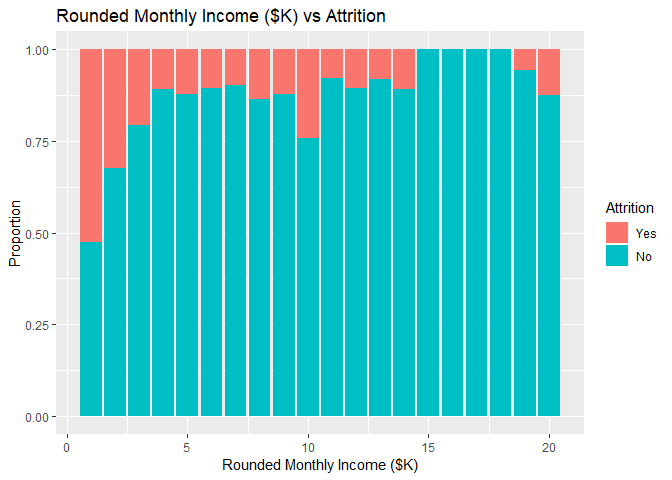
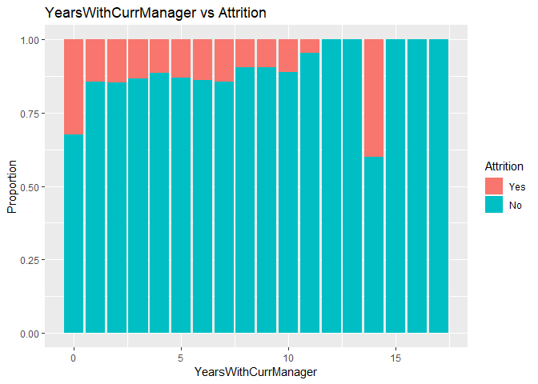

---
title: "MSDS Second Case Study"
author: "Alec Lepe, Che Cobb"
date: "11/28/2018"
output: 
  html_document:
    keep_md: true
---
### Load Libraries

```r
#install.packages("data.table")
#install.packages("readxl")
#install.packages("ggplot2")
#install.packages("reshape")
library("data.table")
library("readxl")
library("ggplot2")
library("reshape")
```

```
## 
## Attaching package: 'reshape'
```

```
## The following object is masked from 'package:data.table':
## 
##     melt
```
### Reproducibility: Session Info

```r
sessionInfo()
```

```
## R version 3.5.0 (2018-04-23)
## Platform: x86_64-apple-darwin15.6.0 (64-bit)
## Running under: macOS High Sierra 10.13.6
## 
## Matrix products: default
## BLAS: /Library/Frameworks/R.framework/Versions/3.5/Resources/lib/libRblas.0.dylib
## LAPACK: /Library/Frameworks/R.framework/Versions/3.5/Resources/lib/libRlapack.dylib
## 
## locale:
## [1] en_US.UTF-8/en_US.UTF-8/en_US.UTF-8/C/en_US.UTF-8/en_US.UTF-8
## 
## attached base packages:
## [1] stats     graphics  grDevices utils     datasets  methods   base     
## 
## other attached packages:
## [1] reshape_0.8.8     ggplot2_2.2.1     readxl_1.1.0      data.table_1.11.4
## 
## loaded via a namespace (and not attached):
##  [1] Rcpp_1.0.0       knitr_1.20       magrittr_1.5     munsell_0.4.3   
##  [5] colorspace_1.3-2 rlang_0.2.0      stringr_1.3.0    plyr_1.8.4      
##  [9] tools_3.5.0      grid_3.5.0       gtable_0.2.0     htmltools_0.3.6 
## [13] yaml_2.2.0       lazyeval_0.2.1   rprojroot_1.3-2  digest_0.6.18   
## [17] tibble_1.4.2     evaluate_0.11    rmarkdown_1.10   stringi_1.2.2   
## [21] pillar_1.2.2     compiler_3.5.0   cellranger_1.1.0 scales_0.5.0    
## [25] backports_1.1.2
```
### Load Data

```r
casedata=data.table::as.data.table(readxl::read_excel("~/MSDS-6306-Second-Case-Study/Data/CaseStudy2-data.xlsx"))
save(casedata,file="~/MSDS-6306-Second-Case-Study/Data/CaseStudy2-data.RData")
load("~/MSDS-6306-Second-Case-Study/Data/CaseStudy2-data.RData")
dim(casedata)
```

```
## [1] 1470   35
```

```r
str(casedata)
```

```
## Classes 'data.table' and 'data.frame':	1470 obs. of  35 variables:
##  $ Age                     : num  41 49 37 33 27 32 59 30 38 36 ...
##  $ Attrition               : chr  "Yes" "No" "Yes" "No" ...
##  $ BusinessTravel          : chr  "Travel_Rarely" "Travel_Frequently" "Travel_Rarely" "Travel_Frequently" ...
##  $ DailyRate               : num  1102 279 1373 1392 591 ...
##  $ Department              : chr  "Sales" "Research & Development" "Research & Development" "Research & Development" ...
##  $ DistanceFromHome        : num  1 8 2 3 2 2 3 24 23 27 ...
##  $ Education               : num  2 1 2 4 1 2 3 1 3 3 ...
##  $ EducationField          : chr  "Life Sciences" "Life Sciences" "Other" "Life Sciences" ...
##  $ EmployeeCount           : num  1 1 1 1 1 1 1 1 1 1 ...
##  $ EmployeeNumber          : num  1 2 4 5 7 8 10 11 12 13 ...
##  $ EnvironmentSatisfaction : num  2 3 4 4 1 4 3 4 4 3 ...
##  $ Gender                  : chr  "Female" "Male" "Male" "Female" ...
##  $ HourlyRate              : num  94 61 92 56 40 79 81 67 44 94 ...
##  $ JobInvolvement          : num  3 2 2 3 3 3 4 3 2 3 ...
##  $ JobLevel                : num  2 2 1 1 1 1 1 1 3 2 ...
##  $ JobRole                 : chr  "Sales Executive" "Research Scientist" "Laboratory Technician" "Research Scientist" ...
##  $ JobSatisfaction         : num  4 2 3 3 2 4 1 3 3 3 ...
##  $ MaritalStatus           : chr  "Single" "Married" "Single" "Married" ...
##  $ MonthlyIncome           : num  5993 5130 2090 2909 3468 ...
##  $ MonthlyRate             : num  19479 24907 2396 23159 16632 ...
##  $ NumCompaniesWorked      : num  8 1 6 1 9 0 4 1 0 6 ...
##  $ Over18                  : chr  "Y" "Y" "Y" "Y" ...
##  $ OverTime                : chr  "Yes" "No" "Yes" "Yes" ...
##  $ PercentSalaryHike       : num  11 23 15 11 12 13 20 22 21 13 ...
##  $ PerformanceRating       : num  3 4 3 3 3 3 4 4 4 3 ...
##  $ RelationshipSatisfaction: num  1 4 2 3 4 3 1 2 2 2 ...
##  $ StandardHours           : num  80 80 80 80 80 80 80 80 80 80 ...
##  $ StockOptionLevel        : num  0 1 0 0 1 0 3 1 0 2 ...
##  $ TotalWorkingYears       : num  8 10 7 8 6 8 12 1 10 17 ...
##  $ TrainingTimesLastYear   : num  0 3 3 3 3 2 3 2 2 3 ...
##  $ WorkLifeBalance         : num  1 3 3 3 3 2 2 3 3 2 ...
##  $ YearsAtCompany          : num  6 10 0 8 2 7 1 1 9 7 ...
##  $ YearsInCurrentRole      : num  4 7 0 7 2 7 0 0 7 7 ...
##  $ YearsSinceLastPromotion : num  0 1 0 3 2 3 0 0 1 7 ...
##  $ YearsWithCurrManager    : num  5 7 0 0 2 6 0 0 8 7 ...
##  - attr(*, ".internal.selfref")=<externalptr>
```
### Detect and Delete Non-Relevant Data

```r
cns=c()
for (cn in colnames(casedata)){
  if(length(table(casedata[[cn]]))==1){
    print(cn)
    cns=append(cn,cns)
  }
}
```

```
## [1] "EmployeeCount"
## [1] "Over18"
## [1] "StandardHours"
```

```r
for (cn in cns){
  print(paste(cn,names(table(casedata[[cn]])),table(casedata[[cn]])))
  casedata=casedata[,!cn,with=F]
}
```

```
## [1] "StandardHours 80 1470"
## [1] "Over18 Y 1470"
## [1] "EmployeeCount 1 1470"
```
Deleted: *Standard Hours*, *Over18*, and *EmplyoeeCount* where there is only one value.

```r
barplot(table(casedata[["Attrition"]]), main="Attrition Count",col=c("Green","Red"))
```

<!-- -->

```r
table(casedata[["Attrition"]])/nrow(casedata)
```

```
## 
##        No       Yes 
## 0.8387755 0.1612245
```
### How does age relate to attrition?

```r
ID="Age"
yes=casedata[,sum(Attrition=="Yes"),ID]; colnames(yes)[2]="Yes"
no=casedata[,sum(Attrition=="No"),ID];   colnames(no)[2]="No"
temp=merge(yes,no,all=T)
temp=melt(temp,id=ID)
temp=as.data.frame(temp)
colnames(temp)=c(ID,"Attrition","Count")
ggplot(temp,aes(fill=Attrition,y=Count,x=eval(as.symbol(ID))))+geom_bar(stat="identity")+xlab(ID)
```

<!-- -->
Here we can see that attrition is greatest between 29 and 35.

```r
temp=merge(temp,as.data.table(temp)[,sum(Count),ID])
colnames(temp)[ncol(temp)]="Total"
temp[["Proportion"]]=temp[["Count"]]/temp[["Total"]]
ggplot(temp,aes(fill=Attrition,y=Proportion,x=eval(as.symbol(ID))))+geom_bar(stat="identity")+xlab(ID)+ggtitle(paste(ID,"vs Attrition"))
```

<!-- -->
Here we see that attrition is greater at earlier ages, with a noticeable peak at age 58.

```r
temp[temp[["Age"]]==58,]
```

```
##    Age Attrition Count Total Proportion
## 81  58       Yes     5    14  0.3571429
## 82  58        No     9    14  0.6428571
```
### How does business travel relate to attrition?

```r
ID="BusinessTravel"
yes=casedata[,sum(Attrition=="Yes"),ID]; colnames(yes)[2]="Yes"
no=casedata[,sum(Attrition=="No"),ID];   colnames(no)[2]="No"
temp=merge(yes,no,all=T)
temp=melt(temp,id=ID)
temp=as.data.frame(temp)
colnames(temp)=c(ID,"Attrition","Count")
temp=merge(temp,as.data.table(temp)[,sum(Count),ID])
colnames(temp)[ncol(temp)]="Total"
temp[["Proportion"]]=temp[["Count"]]/temp[["Total"]]
ggplot(temp,aes(fill=Attrition,y=Proportion,x=eval(as.symbol(ID))))+geom_bar(stat="identity")+xlab(ID)+ggtitle(paste(ID,"vs Attrition"))
```

<!-- -->
Here we can see that attrition, proportionally, is greatest for employees who travel frequently and the least for employees who do not travel.
### Automatically detecting single predictors
We can go on and on plotting individual predictors, but let's try to automate the process.
This R code will go through every numeric variable and see if they can predict attrition.

```r
tempcasedata=casedata
tempcasedata[tempcasedata[["Attrition"]]=="Yes",][["Attrition"]]="1"
tempcasedata[tempcasedata[["Attrition"]]=="No",][["Attrition"]]="0"
mode(tempcasedata[["Attrition"]])="numeric"
pmatrix=matrix(ncol=2,nrow=0)
for (i in setdiff(colnames(tempcasedata),"Attrition")){
  if (mode(tempcasedata[[i]])=='numeric'){
  formula=paste0("Attrition~",i,sep="")
  model=lm(formula,tempcasedata)
  pmatrix=rbind(pmatrix,c(i,summary(model)$coefficients[8]))
}
}
pmatrix=as.data.table(pmatrix[order(as.numeric(pmatrix[,2])),])
colnames(pmatrix)=c("Variable","P-Value")
```
Here are the top 6 variables, based on low P-Values.

```r
head(pmatrix)
```

```
##                Variable              P-Value
## 1:    TotalWorkingYears 4.06187811126712e-11
## 2:             JobLevel 6.79538478002213e-11
## 3:   YearsInCurrentRole  6.0031858436432e-10
## 4:        MonthlyIncome 7.14736398535422e-10
## 5:                  Age  8.3563080211039e-10
## 6: YearsWithCurrManager 1.73698678452455e-09
```

```r
cat(head(pmatrix)[["Variable"]])
```

```
## TotalWorkingYears JobLevel YearsInCurrentRole MonthlyIncome Age YearsWithCurrManager
```
### Plotting Statistically Significant Data
Excluding age as we previouslyu plotted that out.

```r
ID="TotalWorkingYears"
yes=casedata[,sum(Attrition=="Yes"),ID]; colnames(yes)[2]="Yes"
no=casedata[,sum(Attrition=="No"),ID];   colnames(no)[2]="No"
temp=merge(yes,no,all=T)
temp=melt(temp,id=ID)
temp=as.data.frame(temp)
colnames(temp)=c(ID,"Attrition","Count")
temp=merge(temp,as.data.table(temp)[,sum(Count),ID])
colnames(temp)[ncol(temp)]="Total"
temp[["Proportion"]]=temp[["Count"]]/temp[["Total"]]
ggplot(temp,aes(fill=Attrition,y=Proportion,x=eval(as.symbol(ID))))+geom_bar(stat="identity")+xlab(ID)+ggtitle(paste(ID,"vs Attrition"))
```

<!-- -->

Here we see that attrition generally decreases as total working years increases with an outlier at age 40.

```r
temp[temp[["TotalWorkingYears"]]==40,]
```

```
##    TotalWorkingYears Attrition Count Total Proportion
## 79                40       Yes     2     2          1
## 80                40        No     0     2          0
```

```r
ID="JobLevel"
yes=casedata[,sum(Attrition=="Yes"),ID]; colnames(yes)[2]="Yes"
no=casedata[,sum(Attrition=="No"),ID];   colnames(no)[2]="No"
temp=merge(yes,no,all=T)
temp=melt(temp,id=ID)
temp=as.data.frame(temp)
colnames(temp)=c(ID,"Attrition","Count")
temp=merge(temp,as.data.table(temp)[,sum(Count),ID])
colnames(temp)[ncol(temp)]="Total"
temp[["Proportion"]]=temp[["Count"]]/temp[["Total"]]
ggplot(temp,aes(fill=Attrition,y=Proportion,x=eval(as.symbol(ID))))+geom_bar(stat="identity")+xlab(ID)+ggtitle(paste(ID,"vs Attrition"))
```

<!-- -->

Here we see attrition roughly vary between job level.

```r
ID="YearsInCurrentRole"
yes=casedata[,sum(Attrition=="Yes"),ID]; colnames(yes)[2]="Yes"
no=casedata[,sum(Attrition=="No"),ID];   colnames(no)[2]="No"
temp=merge(yes,no,all=T)
temp=melt(temp,id=ID)
temp=as.data.frame(temp)
colnames(temp)=c(ID,"Attrition","Count")
temp=merge(temp,as.data.table(temp)[,sum(Count),ID])
colnames(temp)[ncol(temp)]="Total"
temp[["Proportion"]]=temp[["Count"]]/temp[["Total"]]
ggplot(temp,aes(fill=Attrition,y=Proportion,x=eval(as.symbol(ID))))+geom_bar(stat="identity")+xlab(ID)+ggtitle(paste(ID,"vs Attrition"))
```

<!-- -->

Here we see attrition generally decrease as years in current role increases with seemingly an outlier at age 15.

```r
temp[temp[["YearsInCurrentRole"]]==15,]
```

```
##    YearsInCurrentRole Attrition Count Total Proportion
## 31                 15        No     6     8       0.75
## 32                 15       Yes     2     8       0.25
```


```r
ID="MonthlyIncome2"
casedata[["MonthlyIncome2"]]=round(casedata[["MonthlyIncome"]]/1000)
yes=casedata[,sum(Attrition=="Yes"),ID]; colnames(yes)[2]="Yes"
no=casedata[,sum(Attrition=="No"),ID];   colnames(no)[2]="No"
temp=merge(yes,no,all=T)
temp=melt(temp,id=ID)
temp=as.data.frame(temp)
colnames(temp)=c(ID,"Attrition","Count")
temp=merge(temp,as.data.table(temp)[,sum(Count),ID])
colnames(temp)[ncol(temp)]="Total"
temp[["Proportion"]]=temp[["Count"]]/temp[["Total"]]
ggplot(temp,aes(fill=Attrition,y=Proportion,x=MonthlyIncome2))+geom_bar(stat="identity")+xlab("Rounded Monthly Income ($K)")+ggtitle("Rounded Monthly Income ($K) vs Attrition")
```

<!-- -->

Here we see attrition generally decrease with increases in monthly income levels.

```r
ID="YearsWithCurrManager"
yes=casedata[,sum(Attrition=="Yes"),ID]; colnames(yes)[2]="Yes"
no=casedata[,sum(Attrition=="No"),ID];   colnames(no)[2]="No"
temp=merge(yes,no,all=T)
temp=melt(temp,id=ID)
temp=as.data.frame(temp)
colnames(temp)=c(ID,"Attrition","Count")
temp=merge(temp,as.data.table(temp)[,sum(Count),ID])
colnames(temp)[ncol(temp)]="Total"
temp[["Proportion"]]=temp[["Count"]]/temp[["Total"]]
ggplot(temp,aes(fill=Attrition,y=Proportion,x=eval(as.symbol(ID))))+geom_bar(stat="identity")+xlab(ID)+ggtitle(paste(ID,"vs Attrition"))
```

<!-- -->

Here we see attrition decreasing as years with current manager increases with an outlier at year 14 where we only have 5 total observations.

```r
temp[temp[["YearsWithCurrManager"]]==14,]
```

```
##    YearsWithCurrManager Attrition Count Total Proportion
## 29                   14        No     3     5        0.6
## 30                   14       Yes     2     5        0.4
```
