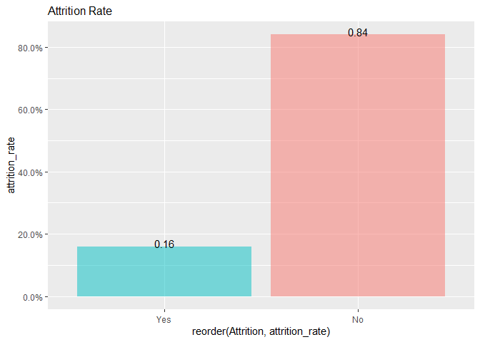
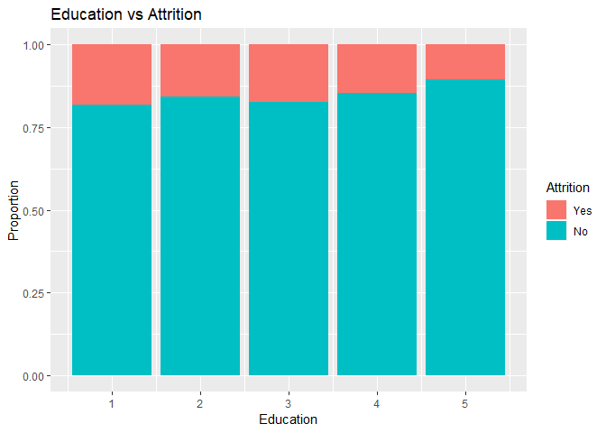
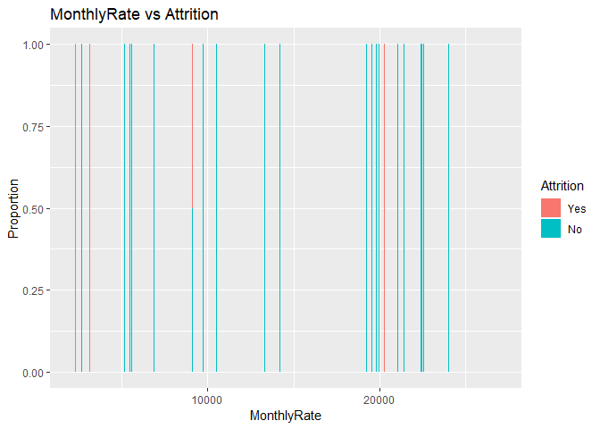
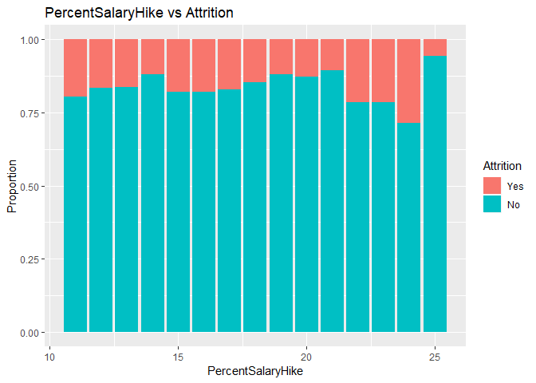
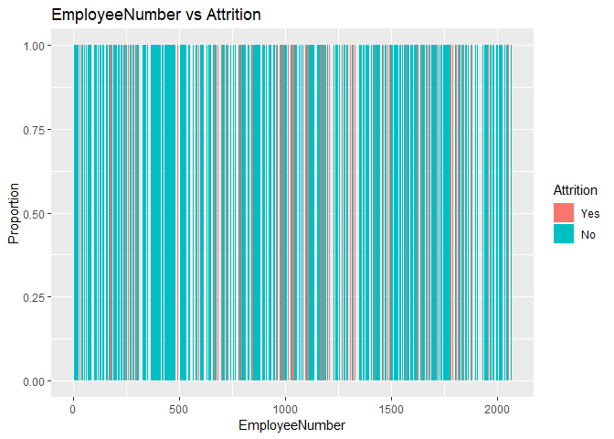
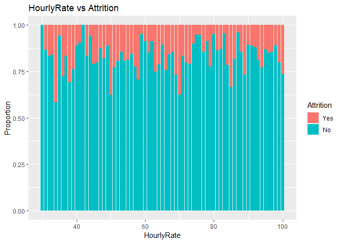
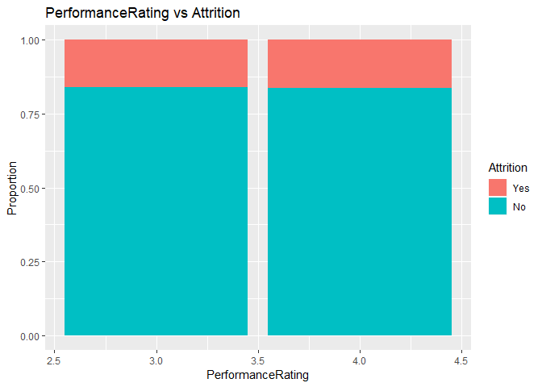

### Load Libraries

```r
#install.packages("data.table")
#install.packages("readxl")
#install.packages("ggplot2")
#install.packages("reshape")
#install.packages("pander")
library("pander")
library("data.table")
library("readxl")
library("ggplot2")
library("reshape")
```

```
## 
## Attaching package: 'reshape'
```

```
## The following object is masked from 'package:data.table':
## 
##     melt
```
### Reproducibility: Session Info

```r
sessionInfo()
```

```
## R version 3.5.0 (2018-04-23)
## Platform: x86_64-apple-darwin15.6.0 (64-bit)
## Running under: macOS High Sierra 10.13.6
## 
## Matrix products: default
## BLAS: /Library/Frameworks/R.framework/Versions/3.5/Resources/lib/libRblas.0.dylib
## LAPACK: /Library/Frameworks/R.framework/Versions/3.5/Resources/lib/libRlapack.dylib
## 
## locale:
## [1] en_US.UTF-8/en_US.UTF-8/en_US.UTF-8/C/en_US.UTF-8/en_US.UTF-8
## 
## attached base packages:
## [1] stats     graphics  grDevices utils     datasets  methods   base     
## 
## other attached packages:
## [1] reshape_0.8.8     ggplot2_2.2.1     readxl_1.1.0      data.table_1.11.4
## [5] pander_0.6.3     
## 
## loaded via a namespace (and not attached):
##  [1] Rcpp_1.0.0       knitr_1.20       magrittr_1.5     munsell_0.4.3   
##  [5] colorspace_1.3-2 rlang_0.2.0      stringr_1.3.0    plyr_1.8.4      
##  [9] tools_3.5.0      grid_3.5.0       gtable_0.2.0     htmltools_0.3.6 
## [13] yaml_2.2.0       lazyeval_0.2.1   rprojroot_1.3-2  digest_0.6.18   
## [17] tibble_1.4.2     evaluate_0.11    rmarkdown_1.10   stringi_1.2.2   
## [21] pillar_1.2.2     compiler_3.5.0   cellranger_1.1.0 scales_0.5.0    
## [25] backports_1.1.2
```
### Load Data

```r
casedata=data.table::as.data.table(readxl::read_excel("Data/CaseStudy2-data.xlsx"))
save(casedata,file="Data/CaseStudy2-data.RData")
load("Data/CaseStudy2-data.RData")
dim(casedata)
```

```
## [1] 1470   35
```

```r
str(casedata)
```

```
## Classes 'data.table' and 'data.frame':	1470 obs. of  35 variables:
##  $ Age                     : num  41 49 37 33 27 32 59 30 38 36 ...
##  $ Attrition               : chr  "Yes" "No" "Yes" "No" ...
##  $ BusinessTravel          : chr  "Travel_Rarely" "Travel_Frequently" "Travel_Rarely" "Travel_Frequently" ...
##  $ DailyRate               : num  1102 279 1373 1392 591 ...
##  $ Department              : chr  "Sales" "Research & Development" "Research & Development" "Research & Development" ...
##  $ DistanceFromHome        : num  1 8 2 3 2 2 3 24 23 27 ...
##  $ Education               : num  2 1 2 4 1 2 3 1 3 3 ...
##  $ EducationField          : chr  "Life Sciences" "Life Sciences" "Other" "Life Sciences" ...
##  $ EmployeeCount           : num  1 1 1 1 1 1 1 1 1 1 ...
##  $ EmployeeNumber          : num  1 2 4 5 7 8 10 11 12 13 ...
##  $ EnvironmentSatisfaction : num  2 3 4 4 1 4 3 4 4 3 ...
##  $ Gender                  : chr  "Female" "Male" "Male" "Female" ...
##  $ HourlyRate              : num  94 61 92 56 40 79 81 67 44 94 ...
##  $ JobInvolvement          : num  3 2 2 3 3 3 4 3 2 3 ...
##  $ JobLevel                : num  2 2 1 1 1 1 1 1 3 2 ...
##  $ JobRole                 : chr  "Sales Executive" "Research Scientist" "Laboratory Technician" "Research Scientist" ...
##  $ JobSatisfaction         : num  4 2 3 3 2 4 1 3 3 3 ...
##  $ MaritalStatus           : chr  "Single" "Married" "Single" "Married" ...
##  $ MonthlyIncome           : num  5993 5130 2090 2909 3468 ...
##  $ MonthlyRate             : num  19479 24907 2396 23159 16632 ...
##  $ NumCompaniesWorked      : num  8 1 6 1 9 0 4 1 0 6 ...
##  $ Over18                  : chr  "Y" "Y" "Y" "Y" ...
##  $ OverTime                : chr  "Yes" "No" "Yes" "Yes" ...
##  $ PercentSalaryHike       : num  11 23 15 11 12 13 20 22 21 13 ...
##  $ PerformanceRating       : num  3 4 3 3 3 3 4 4 4 3 ...
##  $ RelationshipSatisfaction: num  1 4 2 3 4 3 1 2 2 2 ...
##  $ StandardHours           : num  80 80 80 80 80 80 80 80 80 80 ...
##  $ StockOptionLevel        : num  0 1 0 0 1 0 3 1 0 2 ...
##  $ TotalWorkingYears       : num  8 10 7 8 6 8 12 1 10 17 ...
##  $ TrainingTimesLastYear   : num  0 3 3 3 3 2 3 2 2 3 ...
##  $ WorkLifeBalance         : num  1 3 3 3 3 2 2 3 3 2 ...
##  $ YearsAtCompany          : num  6 10 0 8 2 7 1 1 9 7 ...
##  $ YearsInCurrentRole      : num  4 7 0 7 2 7 0 0 7 7 ...
##  $ YearsSinceLastPromotion : num  0 1 0 3 2 3 0 0 1 7 ...
##  $ YearsWithCurrManager    : num  5 7 0 0 2 6 0 0 8 7 ...
##  - attr(*, ".internal.selfref")=<externalptr>
```

```r
library(corrplot)
```

```
## corrplot 0.84 loaded
```

```r
library(magrittr)
numeric=casedata %>% dplyr::select(Age,DailyRate,DistanceFromHome,HourlyRate,MonthlyIncome,MonthlyRate,NumCompaniesWorked,PercentSalaryHike,YearsAtCompany,YearsInCurrentRole,YearsSinceLastPromotion,YearsWithCurrManager,TotalWorkingYears,TrainingTimesLastYear,StockOptionLevel)
corrplot(cor(numeric),method="circle",type="upper")
```

<!-- -->


### Detect and Delete Non-Relevant Data

```r
cns=c()
for (cn in colnames(casedata)){
  if(length(table(casedata[[cn]]))==1){
    print(cn)
    cns=append(cn,cns)
  }
}
```

```
## [1] "EmployeeCount"
## [1] "Over18"
## [1] "StandardHours"
```

```r
for (cn in cns){
  print(paste(cn,names(table(casedata[[cn]])),table(casedata[[cn]])))
  casedata=casedata[,!cn,with=F]
}
```

```
## [1] "StandardHours 80 1470"
## [1] "Over18 Y 1470"
## [1] "EmployeeCount 1 1470"
```
Deleted: *Standard Hours*, *Over18*, and *EmplyoeeCount* where there is only one value.


```r
library(dplyr)
```

```
## Warning: package 'dplyr' was built under R version 3.5.1
```

```
## 
## Attaching package: 'dplyr'
```

```
## The following object is masked from 'package:reshape':
## 
##     rename
```

```
## The following objects are masked from 'package:data.table':
## 
##     between, first, last
```

```
## The following objects are masked from 'package:stats':
## 
##     filter, lag
```

```
## The following objects are masked from 'package:base':
## 
##     intersect, setdiff, setequal, union
```

```r
library(scales)
casedata %>%group_by(Attrition)%>%summarize(attrition_count=n())%>%ungroup()%>%
  mutate(attrition_rate=round(attrition_count/sum(attrition_count),2))%>%ggplot(aes(x=reorder(Attrition,attrition_rate),y=attrition_rate,fill=Attrition)) + geom_bar(stat='identity',alpha=0.5) +
   theme(axis.text.x=element_text(angle=0,vjust=0.5),legend.position='none',plot.title = element_text(size=12))+labs(title="Attrition Rate")+scale_y_continuous(labels=percent_format())+geom_text(aes(label=attrition_rate),vjust=0.1)
```

<!-- -->


### How does age relate to attrition?

```r
ID="Age"
yes=casedata[,sum(Attrition=="Yes"),ID]; colnames(yes)[2]="Yes"
no=casedata[,sum(Attrition=="No"),ID];   colnames(no)[2]="No"
temp=merge(yes,no,all=T)
temp=melt(temp,id=ID)
temp=as.data.frame(temp)
colnames(temp)=c(ID,"Attrition","Count")
ggplot(temp,aes(fill=Attrition,y=Count,x=eval(as.symbol(ID))))+geom_bar(stat="identity")+xlab(ID)
```

<!-- -->

Here we can see that attrition is greatest between 29 and 35.

```r
temp=merge(temp,as.data.table(temp)[,sum(Count),ID])
colnames(temp)[ncol(temp)]="Total"
temp[["Proportion"]]=temp[["Count"]]/temp[["Total"]]
ggplot(temp,aes(fill=Attrition,y=Proportion,x=eval(as.symbol(ID))))+geom_bar(stat="identity")+xlab(ID)+ggtitle(paste(ID,"vs Attrition"))
```

<!-- -->

Here we see that attrition is greater at earlier ages, with a noticeable peak at age 58.

```r
temp[temp[["Age"]]==58,]
```

```
##    Age Attrition Count Total Proportion
## 81  58       Yes     5    14  0.3571429
## 82  58        No     9    14  0.6428571
```
### How does business travel relate to attrition?

```r
ID="BusinessTravel"
yes=casedata[,sum(Attrition=="Yes"),ID]; colnames(yes)[2]="Yes"
no=casedata[,sum(Attrition=="No"),ID];   colnames(no)[2]="No"
temp=merge(yes,no,all=T)
temp=melt(temp,id=ID)
temp=as.data.frame(temp)
colnames(temp)=c(ID,"Attrition","Count")
temp=merge(temp,as.data.table(temp)[,sum(Count),ID])
colnames(temp)[ncol(temp)]="Total"
temp[["Proportion"]]=temp[["Count"]]/temp[["Total"]]
ggplot(temp,aes(fill=Attrition,y=Proportion,x=eval(as.symbol(ID))))+geom_bar(stat="identity")+xlab(ID)+ggtitle(paste(ID,"vs Attrition"))
```

<!-- -->

Here we can see that attrition, proportionally, is greatest for employees who travel frequently and the least for employees who do not travel.

### Automatically Detecting Good Single Predictors
We can go on and on plotting individual predictors, but let's try to automate the process.
This R code will go through every numeric variable and see if they can predict attrition.

```r
tempcasedata=casedata
tempcasedata[tempcasedata[["Attrition"]]=="Yes",][["Attrition"]]="1"
tempcasedata[tempcasedata[["Attrition"]]=="No",][["Attrition"]]="0"
mode(tempcasedata[["Attrition"]])="numeric"
pmatrix=matrix(ncol=2,nrow=0)
for (i in setdiff(colnames(tempcasedata),"Attrition")){
  if (mode(tempcasedata[[i]])=='numeric'){
  formula=paste0("Attrition~",i,sep="")
  model=lm(formula,tempcasedata)
  pmatrix=rbind(pmatrix,c(i,summary(model)$coefficients[8]))
}
}
pmatrix=as.data.table(pmatrix[order(as.numeric(pmatrix[,2])),])
colnames(pmatrix)=c("Variable","P-Value")
```
Here are the top 6 variables, based on low P-Values.

```r
head(pmatrix)
```

```
##                Variable              P-Value
## 1:    TotalWorkingYears 4.06187811126712e-11
## 2:             JobLevel 6.79538478002213e-11
## 3:   YearsInCurrentRole  6.0031858436432e-10
## 4:        MonthlyIncome 7.14736398535422e-10
## 5:                  Age  8.3563080211039e-10
## 6: YearsWithCurrManager 1.73698678452455e-09
```

```r
cat(head(pmatrix)[["Variable"]])
```

```
## TotalWorkingYears JobLevel YearsInCurrentRole MonthlyIncome Age YearsWithCurrManager
```
### Plotting Statistically Significant Data
Excluding age as we previouslyu plotted that out.

```r
ID="TotalWorkingYears"
yes=casedata[,sum(Attrition=="Yes"),ID]; colnames(yes)[2]="Yes"
no=casedata[,sum(Attrition=="No"),ID];   colnames(no)[2]="No"
temp=merge(yes,no,all=T)
temp=melt(temp,id=ID)
temp=as.data.frame(temp)
colnames(temp)=c(ID,"Attrition","Count")
temp=merge(temp,as.data.table(temp)[,sum(Count),ID])
colnames(temp)[ncol(temp)]="Total"
temp[["Proportion"]]=temp[["Count"]]/temp[["Total"]]
ggplot(temp,aes(fill=Attrition,y=Proportion,x=eval(as.symbol(ID))))+geom_bar(stat="identity")+xlab(ID)+ggtitle(paste(ID,"vs Attrition"))
```

<!-- -->

**Here we see that attrition generally decreases as total working years increases with an outlier at age 40.**


```r
temp[temp[["TotalWorkingYears"]]==40,]
```

```
##    TotalWorkingYears Attrition Count Total Proportion
## 79                40       Yes     2     2          1
## 80                40        No     0     2          0
```

```r
ID="JobLevel"
yes=casedata[,sum(Attrition=="Yes"),ID]; colnames(yes)[2]="Yes"
no=casedata[,sum(Attrition=="No"),ID];   colnames(no)[2]="No"
temp=merge(yes,no,all=T)
temp=melt(temp,id=ID)
temp=as.data.frame(temp)
colnames(temp)=c(ID,"Attrition","Count")
temp=merge(temp,as.data.table(temp)[,sum(Count),ID])
colnames(temp)[ncol(temp)]="Total"
temp[["Proportion"]]=temp[["Count"]]/temp[["Total"]]
ggplot(temp,aes(fill=Attrition,y=Proportion,x=eval(as.symbol(ID))))+geom_bar(stat="identity")+xlab(ID)+ggtitle(paste(ID,"vs Attrition"))
```

<!-- -->

**Here we see attrition roughly vary between job level.**


```r
ID="YearsInCurrentRole"
yes=casedata[,sum(Attrition=="Yes"),ID]; colnames(yes)[2]="Yes"
no=casedata[,sum(Attrition=="No"),ID];   colnames(no)[2]="No"
temp=merge(yes,no,all=T)
temp=melt(temp,id=ID)
temp=as.data.frame(temp)
colnames(temp)=c(ID,"Attrition","Count")
temp=merge(temp,as.data.table(temp)[,sum(Count),ID])
colnames(temp)[ncol(temp)]="Total"
temp[["Proportion"]]=temp[["Count"]]/temp[["Total"]]
ggplot(temp,aes(fill=Attrition,y=Proportion,x=eval(as.symbol(ID))))+geom_bar(stat="identity")+xlab(ID)+ggtitle(paste(ID,"vs Attrition"))
```

<!-- -->

**Here we see attrition generally decrease as years in current role increases with seemingly an outlier at year 15.**


```r
temp[temp[["YearsInCurrentRole"]]==15,]
```

```
##    YearsInCurrentRole Attrition Count Total Proportion
## 31                 15        No     6     8       0.75
## 32                 15       Yes     2     8       0.25
```


```r
ID="MonthlyIncome2"
casedata[["MonthlyIncome2"]]=round(casedata[["MonthlyIncome"]]/1000)
yes=casedata[,sum(Attrition=="Yes"),ID]; colnames(yes)[2]="Yes"
no=casedata[,sum(Attrition=="No"),ID];   colnames(no)[2]="No"
temp=merge(yes,no,all=T)
temp=melt(temp,id=ID)
temp=as.data.frame(temp)
colnames(temp)=c(ID,"Attrition","Count")
temp=merge(temp,as.data.table(temp)[,sum(Count),ID])
colnames(temp)[ncol(temp)]="Total"
temp[["Proportion"]]=temp[["Count"]]/temp[["Total"]]
ggplot(temp,aes(fill=Attrition,y=Proportion,x=MonthlyIncome2))+geom_bar(stat="identity")+xlab("Rounded Monthly Income ($K)")+ggtitle("Rounded Monthly Income ($K) vs Attrition")
```

<!-- -->

**Here we see attrition generally decrease with increases in monthly income levels.**


```r
ID="YearsWithCurrManager"
yes=casedata[,sum(Attrition=="Yes"),ID]; colnames(yes)[2]="Yes"
no=casedata[,sum(Attrition=="No"),ID];   colnames(no)[2]="No"
temp=merge(yes,no,all=T)
temp=melt(temp,id=ID)
temp=as.data.frame(temp)
colnames(temp)=c(ID,"Attrition","Count")
temp=merge(temp,as.data.table(temp)[,sum(Count),ID])
colnames(temp)[ncol(temp)]="Total"
temp[["Proportion"]]=temp[["Count"]]/temp[["Total"]]
ggplot(temp,aes(fill=Attrition,y=Proportion,x=eval(as.symbol(ID))))+geom_bar(stat="identity")+xlab(ID)+ggtitle(paste(ID,"vs Attrition"))
```

<!-- -->

**Here we see attrition decreasing as years with current manager increases with an outlier at year 14 where we only have 5 total observations.**


```r
temp[temp[["YearsWithCurrManager"]]==14,]
```

```
##    YearsWithCurrManager Attrition Count Total Proportion
## 29                   14        No     3     5        0.6
## 30                   14       Yes     2     5        0.4
```

### Worst Indicators
Now let's take a look at the worst indicators.


```r
tail(pmatrix)
```

```
##             Variable           P-Value
## 1:         Education 0.229315203322316
## 2:       MonthlyRate 0.561123598224303
## 3: PercentSalaryHike 0.605612823889383
## 4:    EmployeeNumber 0.685327589729713
## 5:        HourlyRate 0.793134768994436
## 6: PerformanceRating 0.911884042107093
```


```r
ID="Education"
yes=casedata[,sum(Attrition=="Yes"),ID]; colnames(yes)[2]="Yes"
no=casedata[,sum(Attrition=="No"),ID];   colnames(no)[2]="No"
temp=merge(yes,no,all=T)
temp=melt(temp,id=ID)
temp=as.data.frame(temp)
colnames(temp)=c(ID,"Attrition","Count")
temp=merge(temp,as.data.table(temp)[,sum(Count),ID])
colnames(temp)[ncol(temp)]="Total"
temp[["Proportion"]]=temp[["Count"]]/temp[["Total"]]
ggplot(temp,aes(fill=Attrition,y=Proportion,x=eval(as.symbol(ID))))+geom_bar(stat="identity")+xlab(ID)+ggtitle(paste(ID,"vs Attrition"))
```

<!-- -->

```r
ID="MonthlyRate"
yes=casedata[,sum(Attrition=="Yes"),ID]; colnames(yes)[2]="Yes"
no=casedata[,sum(Attrition=="No"),ID];   colnames(no)[2]="No"
temp=merge(yes,no,all=T)
temp=melt(temp,id=ID)
temp=as.data.frame(temp)
colnames(temp)=c(ID,"Attrition","Count")
temp=merge(temp,as.data.table(temp)[,sum(Count),ID])
colnames(temp)[ncol(temp)]="Total"
temp[["Proportion"]]=temp[["Count"]]/temp[["Total"]]
ggplot(temp,aes(fill=Attrition,y=Proportion,x=eval(as.symbol(ID))))+geom_bar(stat="identity")+xlab(ID)+ggtitle(paste(ID,"vs Attrition"))
```

<!-- -->

```r
ID="PercentSalaryHike"
yes=casedata[,sum(Attrition=="Yes"),ID]; colnames(yes)[2]="Yes"
no=casedata[,sum(Attrition=="No"),ID];   colnames(no)[2]="No"
temp=merge(yes,no,all=T)
temp=melt(temp,id=ID)
temp=as.data.frame(temp)
colnames(temp)=c(ID,"Attrition","Count")
temp=merge(temp,as.data.table(temp)[,sum(Count),ID])
colnames(temp)[ncol(temp)]="Total"
temp[["Proportion"]]=temp[["Count"]]/temp[["Total"]]
ggplot(temp,aes(fill=Attrition,y=Proportion,x=eval(as.symbol(ID))))+geom_bar(stat="identity")+xlab(ID)+ggtitle(paste(ID,"vs Attrition"))
```

<!-- -->

```r
ID="EmployeeNumber"
yes=casedata[,sum(Attrition=="Yes"),ID]; colnames(yes)[2]="Yes"
no=casedata[,sum(Attrition=="No"),ID];   colnames(no)[2]="No"
temp=merge(yes,no,all=T)
temp=melt(temp,id=ID)
temp=as.data.frame(temp)
colnames(temp)=c(ID,"Attrition","Count")
temp=merge(temp,as.data.table(temp)[,sum(Count),ID])
colnames(temp)[ncol(temp)]="Total"
temp[["Proportion"]]=temp[["Count"]]/temp[["Total"]]
ggplot(temp,aes(fill=Attrition,y=Proportion,x=eval(as.symbol(ID))))+geom_bar(stat="identity")+xlab(ID)+ggtitle(paste(ID,"vs Attrition"))
```

<!-- -->

```r
ID="HourlyRate"
yes=casedata[,sum(Attrition=="Yes"),ID]; colnames(yes)[2]="Yes"
no=casedata[,sum(Attrition=="No"),ID];   colnames(no)[2]="No"
temp=merge(yes,no,all=T)
temp=melt(temp,id=ID)
temp=as.data.frame(temp)
colnames(temp)=c(ID,"Attrition","Count")
temp=merge(temp,as.data.table(temp)[,sum(Count),ID])
colnames(temp)[ncol(temp)]="Total"
temp[["Proportion"]]=temp[["Count"]]/temp[["Total"]]
ggplot(temp,aes(fill=Attrition,y=Proportion,x=eval(as.symbol(ID))))+geom_bar(stat="identity")+xlab(ID)+ggtitle(paste(ID,"vs Attrition"))
```

<!-- -->

```r
ID="PerformanceRating"
yes=casedata[,sum(Attrition=="Yes"),ID]; colnames(yes)[2]="Yes"
no=casedata[,sum(Attrition=="No"),ID];   colnames(no)[2]="No"
temp=merge(yes,no,all=T)
temp=melt(temp,id=ID)
temp=as.data.frame(temp)
colnames(temp)=c(ID,"Attrition","Count")
temp=merge(temp,as.data.table(temp)[,sum(Count),ID])
colnames(temp)[ncol(temp)]="Total"
temp[["Proportion"]]=temp[["Count"]]/temp[["Total"]]
ggplot(temp,aes(fill=Attrition,y=Proportion,x=eval(as.symbol(ID))))+geom_bar(stat="identity")+xlab(ID)+ggtitle(paste(ID,"vs Attrition"))
```

<!-- -->

**There is no significant trends in the worst rated indicators**


```r
temp
```

```
##   PerformanceRating Attrition Count Total Proportion
## 1                 3       Yes   200  1244  0.1607717
## 2                 3        No  1044  1244  0.8392283
## 3                 4       Yes    37   226  0.1637168
## 4                 4        No   189   226  0.8362832
```

###Prep Data for logistic modeling

```r
cns=setdiff(colnames(casedata),"Attrition")
for (cn in cns){
  if (mode(casedata[[cn]])!="numeric"){
    casedata[[cn]]=as.factor(casedata[[cn]])
  }
}
casedata[casedata[["Attrition"]]=="Yes",][["Attrition"]]="1"
casedata[casedata[["Attrition"]]=="No",][["Attrition"]]="0"
mode(casedata[["Attrition"]])="numeric"
```

###Select test data set, 70% of given data.

```r
smp<-floor(0.7*nrow(casedata))
set.seed(1337)
ind <- sample(seq_len(nrow(casedata)),size=smp)
train <- casedata[ind,]
test <- casedata[-ind,]
model <- glm(Attrition ~ ., family = 'binomial', data = train)
summary(model)
```

```
## 
## Call:
## glm(formula = Attrition ~ ., family = "binomial", data = train)
## 
## Deviance Residuals: 
##     Min       1Q   Median       3Q      Max  
## -1.6700  -0.4642  -0.2300  -0.0765   3.3223  
## 
## Coefficients:
##                                    Estimate Std. Error z value Pr(>|z|)
## (Intercept)                      -1.400e+01  6.888e+02  -0.020 0.983786
## Age                              -4.240e-02  1.744e-02  -2.430 0.015078
## BusinessTravelTravel_Frequently   2.407e+00  5.567e-01   4.323 1.54e-05
## BusinessTravelTravel_Rarely       1.323e+00  5.204e-01   2.542 0.011010
## DailyRate                        -2.376e-04  2.726e-04  -0.872 0.383406
## DepartmentResearch & Development  1.406e+01  6.888e+02   0.020 0.983710
## DepartmentSales                   1.297e+01  6.888e+02   0.019 0.984980
## DistanceFromHome                  4.681e-02  1.339e-02   3.497 0.000470
## Education                         4.177e-02  1.089e-01   0.384 0.701280
## EducationFieldLife Sciences      -7.117e-02  1.151e+00  -0.062 0.950688
## EducationFieldMarketing           7.166e-02  1.212e+00   0.059 0.952856
## EducationFieldMedical            -1.788e-01  1.156e+00  -0.155 0.877108
## EducationFieldOther              -7.992e-01  1.230e+00  -0.650 0.515855
## EducationFieldTechnical Degree    5.170e-01  1.188e+00   0.435 0.663282
## EmployeeNumber                   -8.025e-05  1.892e-04  -0.424 0.671496
## EnvironmentSatisfaction          -6.136e-01  1.034e-01  -5.932 2.99e-09
## GenderMale                        3.436e-01  2.293e-01   1.499 0.133945
## HourlyRate                        3.893e-04  5.385e-03   0.072 0.942362
## JobInvolvement                   -5.687e-01  1.582e-01  -3.594 0.000326
## JobLevel                         -1.366e-02  3.819e-01  -0.036 0.971461
## JobRoleHuman Resources            1.660e+01  6.888e+02   0.024 0.980769
## JobRoleLaboratory Technician      2.424e+00  7.400e-01   3.275 0.001055
## JobRoleManager                    1.292e+00  1.079e+00   1.198 0.231065
## JobRoleManufacturing Director     1.001e+00  7.785e-01   1.286 0.198511
## JobRoleResearch Director         -5.823e-01  1.155e+00  -0.504 0.614127
## JobRoleResearch Scientist         1.737e+00  7.523e-01   2.309 0.020921
## JobRoleSales Executive            3.168e+00  1.452e+00   2.181 0.029154
## JobRoleSales Representative       4.308e+00  1.513e+00   2.847 0.004417
## JobSatisfaction                  -3.660e-01  1.015e-01  -3.606 0.000311
## MaritalStatusMarried              1.723e-01  3.149e-01   0.547 0.584267
## MaritalStatusSingle               1.067e+00  4.156e-01   2.566 0.010276
## MonthlyIncome                     3.786e-04  4.192e-04   0.903 0.366473
## MonthlyRate                       9.806e-06  1.528e-05   0.642 0.521052
## NumCompaniesWorked                2.202e-01  4.810e-02   4.578 4.70e-06
## OverTimeYes                       2.057e+00  2.459e-01   8.365  < 2e-16
## PercentSalaryHike                -7.425e-02  5.005e-02  -1.484 0.137912
## PerformanceRating                 5.847e-01  5.014e-01   1.166 0.243539
## RelationshipSatisfaction         -2.261e-01  1.038e-01  -2.179 0.029350
## StockOptionLevel                 -1.158e-01  1.871e-01  -0.619 0.536078
## TotalWorkingYears                -8.186e-02  3.724e-02  -2.198 0.027938
## TrainingTimesLastYear            -2.233e-01  9.365e-02  -2.384 0.017116
## WorkLifeBalance                  -4.410e-01  1.582e-01  -2.787 0.005316
## YearsAtCompany                    4.756e-02  4.800e-02   0.991 0.321785
## YearsInCurrentRole               -8.831e-02  5.601e-02  -1.577 0.114884
## YearsSinceLastPromotion           1.713e-01  5.516e-02   3.105 0.001905
## YearsWithCurrManager             -1.138e-01  5.981e-02  -1.903 0.057070
## MonthlyIncome2                   -2.818e-01  3.877e-01  -0.727 0.467364
##                                     
## (Intercept)                         
## Age                              *  
## BusinessTravelTravel_Frequently  ***
## BusinessTravelTravel_Rarely      *  
## DailyRate                           
## DepartmentResearch & Development    
## DepartmentSales                     
## DistanceFromHome                 ***
## Education                           
## EducationFieldLife Sciences         
## EducationFieldMarketing             
## EducationFieldMedical               
## EducationFieldOther                 
## EducationFieldTechnical Degree      
## EmployeeNumber                      
## EnvironmentSatisfaction          ***
## GenderMale                          
## HourlyRate                          
## JobInvolvement                   ***
## JobLevel                            
## JobRoleHuman Resources              
## JobRoleLaboratory Technician     ** 
## JobRoleManager                      
## JobRoleManufacturing Director       
## JobRoleResearch Director            
## JobRoleResearch Scientist        *  
## JobRoleSales Executive           *  
## JobRoleSales Representative      ** 
## JobSatisfaction                  ***
## MaritalStatusMarried                
## MaritalStatusSingle              *  
## MonthlyIncome                       
## MonthlyRate                         
## NumCompaniesWorked               ***
## OverTimeYes                      ***
## PercentSalaryHike                   
## PerformanceRating                   
## RelationshipSatisfaction         *  
## StockOptionLevel                    
## TotalWorkingYears                *  
## TrainingTimesLastYear            *  
## WorkLifeBalance                  ** 
## YearsAtCompany                      
## YearsInCurrentRole                  
## YearsSinceLastPromotion          ** 
## YearsWithCurrManager             .  
## MonthlyIncome2                      
## ---
## Signif. codes:  0 '***' 0.001 '**' 0.01 '*' 0.05 '.' 0.1 ' ' 1
## 
## (Dispersion parameter for binomial family taken to be 1)
## 
##     Null deviance: 889.30  on 1028  degrees of freedom
## Residual deviance: 567.17  on  982  degrees of freedom
## AIC: 661.17
## 
## Number of Fisher Scoring iterations: 15
```

```r
sort(summary(model)$coefficients[,4])
```

```
##                      OverTimeYes          EnvironmentSatisfaction 
##                     6.020049e-17                     2.987575e-09 
##               NumCompaniesWorked  BusinessTravelTravel_Frequently 
##                     4.704626e-06                     1.538695e-05 
##                  JobSatisfaction                   JobInvolvement 
##                     3.108828e-04                     3.259730e-04 
##                 DistanceFromHome     JobRoleLaboratory Technician 
##                     4.696854e-04                     1.055045e-03 
##          YearsSinceLastPromotion      JobRoleSales Representative 
##                     1.904508e-03                     4.417167e-03 
##                  WorkLifeBalance              MaritalStatusSingle 
##                     5.315988e-03                     1.027557e-02 
##      BusinessTravelTravel_Rarely                              Age 
##                     1.100990e-02                     1.507809e-02 
##            TrainingTimesLastYear        JobRoleResearch Scientist 
##                     1.711564e-02                     2.092100e-02 
##                TotalWorkingYears           JobRoleSales Executive 
##                     2.793769e-02                     2.915360e-02 
##         RelationshipSatisfaction             YearsWithCurrManager 
##                     2.935008e-02                     5.706970e-02 
##               YearsInCurrentRole                       GenderMale 
##                     1.148842e-01                     1.339454e-01 
##                PercentSalaryHike    JobRoleManufacturing Director 
##                     1.379117e-01                     1.985108e-01 
##                   JobRoleManager                PerformanceRating 
##                     2.310651e-01                     2.435390e-01 
##                   YearsAtCompany                    MonthlyIncome 
##                     3.217849e-01                     3.664730e-01 
##                        DailyRate                   MonthlyIncome2 
##                     3.834058e-01                     4.673636e-01 
##              EducationFieldOther                      MonthlyRate 
##                     5.158552e-01                     5.210519e-01 
##                 StockOptionLevel             MaritalStatusMarried 
##                     5.360777e-01                     5.842668e-01 
##         JobRoleResearch Director   EducationFieldTechnical Degree 
##                     6.141268e-01                     6.632818e-01 
##                   EmployeeNumber                        Education 
##                     6.714958e-01                     7.012805e-01 
##            EducationFieldMedical                       HourlyRate 
##                     8.771082e-01                     9.423620e-01 
##      EducationFieldLife Sciences          EducationFieldMarketing 
##                     9.506883e-01                     9.528562e-01 
##                         JobLevel           JobRoleHuman Resources 
##                     9.714610e-01                     9.807688e-01 
## DepartmentResearch & Development                      (Intercept) 
##                     9.837100e-01                     9.837865e-01 
##                  DepartmentSales 
##                     9.849799e-01
```

###Select Statistically Significant Variables
alpha = 0.05

```r
coefs=summary(model)$coefficients
temp=coefs[coefs[,4]<0.05,]
temp[,4][order(temp[,4])]
```

```
##                     OverTimeYes         EnvironmentSatisfaction 
##                    6.020049e-17                    2.987575e-09 
##              NumCompaniesWorked BusinessTravelTravel_Frequently 
##                    4.704626e-06                    1.538695e-05 
##                 JobSatisfaction                  JobInvolvement 
##                    3.108828e-04                    3.259730e-04 
##                DistanceFromHome    JobRoleLaboratory Technician 
##                    4.696854e-04                    1.055045e-03 
##         YearsSinceLastPromotion     JobRoleSales Representative 
##                    1.904508e-03                    4.417167e-03 
##                 WorkLifeBalance             MaritalStatusSingle 
##                    5.315988e-03                    1.027557e-02 
##     BusinessTravelTravel_Rarely                             Age 
##                    1.100990e-02                    1.507809e-02 
##           TrainingTimesLastYear       JobRoleResearch Scientist 
##                    1.711564e-02                    2.092100e-02 
##               TotalWorkingYears          JobRoleSales Executive 
##                    2.793769e-02                    2.915360e-02 
##        RelationshipSatisfaction 
##                    2.935008e-02
```

```r
variables=names(temp[,4][order(temp[,4])])
variables
```

```
##  [1] "OverTimeYes"                     "EnvironmentSatisfaction"        
##  [3] "NumCompaniesWorked"              "BusinessTravelTravel_Frequently"
##  [5] "JobSatisfaction"                 "JobInvolvement"                 
##  [7] "DistanceFromHome"                "JobRoleLaboratory Technician"   
##  [9] "YearsSinceLastPromotion"         "JobRoleSales Representative"    
## [11] "WorkLifeBalance"                 "MaritalStatusSingle"            
## [13] "BusinessTravelTravel_Rarely"     "Age"                            
## [15] "TrainingTimesLastYear"           "JobRoleResearch Scientist"      
## [17] "TotalWorkingYears"               "JobRoleSales Executive"         
## [19] "RelationshipSatisfaction"
```

```r
formula_vars=c()
for (var in variables){
  if (var %in% colnames(casedata)){
    formula_vars=c(formula_vars,var)
  } else {
    letters=strsplit(var,"")[[1]]
    word=c()
    for (letter in letters){
      word=paste0(word,letter,sep="")
      if (word %in% colnames(casedata)){
        formula_vars=c(formula_vars,word)
      }
    }
  }
}
formula_vars=unique(formula_vars)
formula=paste0(paste0(formula_vars,sep="+"),collapse="")
formula=paste0(strsplit(formula,"")[[1]][1:(length(strsplit(formula,"")[[1]])-1)],collapse = "")
formula=paste0("Attrition~",formula,collapse="")
formula
```

```
## [1] "Attrition~OverTime+EnvironmentSatisfaction+NumCompaniesWorked+BusinessTravel+JobSatisfaction+JobInvolvement+DistanceFromHome+JobRole+YearsSinceLastPromotion+WorkLifeBalance+MaritalStatus+Age+TrainingTimesLastYear+TotalWorkingYears+RelationshipSatisfaction"
```

```r
glm(formula,family = 'binomial', data = train)
```

```
## 
## Call:  glm(formula = formula, family = "binomial", data = train)
## 
## Coefficients:
##                     (Intercept)                      OverTimeYes  
##                         0.83745                          1.99343  
##         EnvironmentSatisfaction               NumCompaniesWorked  
##                        -0.60240                          0.23236  
## BusinessTravelTravel_Frequently      BusinessTravelTravel_Rarely  
##                         2.56362                          1.49671  
##                 JobSatisfaction                   JobInvolvement  
##                        -0.37784                         -0.60576  
##                DistanceFromHome           JobRoleHuman Resources  
##                         0.04455                          2.34108  
##    JobRoleLaboratory Technician                   JobRoleManager  
##                         2.13240                          1.63850  
##   JobRoleManufacturing Director         JobRoleResearch Director  
##                         0.90060                          0.26489  
##       JobRoleResearch Scientist           JobRoleSales Executive  
##                         1.42650                          2.05567  
##     JobRoleSales Representative          YearsSinceLastPromotion  
##                         2.95468                          0.14486  
##                 WorkLifeBalance             MaritalStatusMarried  
##                        -0.45345                          0.18374  
##             MaritalStatusSingle                              Age  
##                         1.21383                         -0.03718  
##           TrainingTimesLastYear                TotalWorkingYears  
##                        -0.22048                         -0.08789  
##        RelationshipSatisfaction  
##                        -0.19261  
## 
## Degrees of Freedom: 1028 Total (i.e. Null);  1004 Residual
## Null Deviance:	    889.3 
## Residual Deviance: 592.2 	AIC: 642.2
```

###Run New Linear Model

```r
newmodel <- glm(formula, family = 'binomial', data = train)
pander(newmodel)
```


-----------------------------------------------------------------------------------
               &nbsp;                  Estimate   Std. Error   z value   Pr(>|z|)  
------------------------------------- ---------- ------------ --------- -----------
           **(Intercept)**              0.8375      1.219      0.6868     0.4922   

           **OverTimeYes**              1.993       0.2347      8.495    1.983e-17 

     **EnvironmentSatisfaction**       -0.6024     0.09936     -6.063    1.34e-09  

       **NumCompaniesWorked**           0.2324     0.04451      5.22     1.789e-07 

 **BusinessTravelTravel_Frequently**    2.564       0.5457      4.698    2.629e-06 

   **BusinessTravelTravel_Rarely**      1.497       0.5089      2.941    0.003273  

         **JobSatisfaction**           -0.3778     0.09701     -3.895    9.819e-05 

         **JobInvolvement**            -0.6058      0.1516     -3.995    6.46e-05  

        **DistanceFromHome**           0.04455     0.01274      3.497    0.0004703 

     **JobRoleHuman Resources**         2.341       0.8442      2.773    0.005552  

         **JobRoleLaboratory            2.132       0.6797      3.137    0.001705  
            Technician**                                                           

         **JobRoleManager**             1.639       0.8599      1.905     0.05673  

       **JobRoleManufacturing           0.9006      0.764       1.179     0.2385   
             Director**                                                            

    **JobRoleResearch Director**        0.2649      1.016      0.2607     0.7943   

    **JobRoleResearch Scientist**       1.426       0.6855      2.081     0.03743  

     **JobRoleSales Executive**         2.056       0.6669      3.083    0.002053  

           **JobRoleSales               2.955       0.7346      4.022    5.771e-05 
          Representative**                                                         

     **YearsSinceLastPromotion**        0.1449     0.04291      3.376    0.0007358 

         **WorkLifeBalance**           -0.4535      0.1505     -3.012    0.002594  

      **MaritalStatusMarried**          0.1837      0.3005     0.6115     0.5409   

       **MaritalStatusSingle**          1.214       0.3079      3.942    8.077e-05 

               **Age**                 -0.03718    0.01637     -2.272     0.02309  

      **TrainingTimesLastYear**        -0.2205     0.09201     -2.396     0.01657  

        **TotalWorkingYears**          -0.08789    0.02772     -3.171     0.00152  

    **RelationshipSatisfaction**       -0.1926     0.09882     -1.949     0.05127  
-----------------------------------------------------------------------------------

Table: Fitting generalized (binomial/logit) linear model: formula

```r
sort(summary(newmodel)$coefficients[,4])
```

```
##                     OverTimeYes         EnvironmentSatisfaction 
##                    1.982890e-17                    1.339629e-09 
##              NumCompaniesWorked BusinessTravelTravel_Frequently 
##                    1.788985e-07                    2.628938e-06 
##     JobRoleSales Representative                  JobInvolvement 
##                    5.770751e-05                    6.459506e-05 
##             MaritalStatusSingle                 JobSatisfaction 
##                    8.076814e-05                    9.818905e-05 
##                DistanceFromHome         YearsSinceLastPromotion 
##                    4.703270e-04                    7.358070e-04 
##               TotalWorkingYears    JobRoleLaboratory Technician 
##                    1.519567e-03                    1.704769e-03 
##          JobRoleSales Executive                 WorkLifeBalance 
##                    2.052676e-03                    2.593861e-03 
##     BusinessTravelTravel_Rarely          JobRoleHuman Resources 
##                    3.273422e-03                    5.552400e-03 
##           TrainingTimesLastYear                             Age 
##                    1.656713e-02                    2.308832e-02 
##       JobRoleResearch Scientist        RelationshipSatisfaction 
##                    3.743095e-02                    5.127044e-02 
##                  JobRoleManager   JobRoleManufacturing Director 
##                    5.673055e-02                    2.384682e-01 
##                     (Intercept)            MaritalStatusMarried 
##                    4.922274e-01                    5.408844e-01 
##        JobRoleResearch Director 
##                    7.942885e-01
```

###Model Evaluation: Training Data Set

```r
predmodel=round(predict(newmodel,train,type='response'),digits=0)
modelcomparison= as.data.table(cbind(predmodel,train$Attrition,train$EmployeeNumber))
colnames(modelcomparison)=c("Predicted","Actual","EmployeeNumber")
modelcomparison
```

```
##       Predicted Actual EmployeeNumber
##    1:         0      0           1184
##    2:         1      1           1157
##    3:         0      0            143
##    4:         1      0            925
##    5:         0      1            752
##   ---                                
## 1025:         0      0             10
## 1026:         0      0           1881
## 1027:         1      1           1752
## 1028:         0      0           1399
## 1029:         0      1            825
```

```r
TN=nrow(modelcomparison[modelcomparison[["Predicted"]]==0 & modelcomparison[["Actual"]]==0,])
FN=nrow(modelcomparison[modelcomparison[["Predicted"]]==0 & modelcomparison[["Actual"]]==1,])
TP=nrow(modelcomparison[modelcomparison[["Predicted"]]==1 & modelcomparison[["Actual"]]==1,])
FP=nrow(modelcomparison[modelcomparison[["Predicted"]]==1 & modelcomparison[["Actual"]]==0,])
mat=matrix(ncol=2,nrow=2)
mat[1,1]=TN
mat[1,2]=FP
mat[2,1]=FN
mat[2,2]=TP
colnames(mat)=c("Predicted=0","Predicted=1")
rownames(mat)=c("Actual=0","Actual=1")
print(nrow(train)==sum(mat))
```

```
## [1] TRUE
```

```r
TrainResults=mat
TrainResults
```

```
##          Predicted=0 Predicted=1
## Actual=0         847          22
## Actual=1          86          74
```

```r
mat=mat/sum(mat)
RelTrainResults=mat
RelTrainResults
```

```
##          Predicted=0 Predicted=1
## Actual=0  0.82312925  0.02137998
## Actual=1  0.08357629  0.07191448
```

```r
cat("Total Training Dataset Accuracy: ",(TP+TN)/sum(TrainResults))
```

```
## Total Training Dataset Accuracy:  0.8950437
```
###Model Evaluation: Test Data Set

```r
predmodel=round(predict(newmodel,test,type='response'),digits=0)
modelcomparison= as.data.table(cbind(predmodel,test$Attrition,test$EmployeeNumber))
colnames(modelcomparison)=c("Predicted","Actual","EmployeeNumber")
modelcomparison
```

```
##      Predicted Actual EmployeeNumber
##   1:         0      0              2
##   2:         1      1              4
##   3:         0      0              8
##   4:         0      0             18
##   5:         0      0             22
##  ---                                
## 437:         0      1           2032
## 438:         0      0           2034
## 439:         0      0           2049
## 440:         0      0           2065
## 441:         0      0           2068
```

```r
TN=nrow(modelcomparison[modelcomparison[["Predicted"]]==0 & modelcomparison[["Actual"]]==0,])
FN=nrow(modelcomparison[modelcomparison[["Predicted"]]==0 & modelcomparison[["Actual"]]==1,])
TP=nrow(modelcomparison[modelcomparison[["Predicted"]]==1 & modelcomparison[["Actual"]]==1,])
FP=nrow(modelcomparison[modelcomparison[["Predicted"]]==1 & modelcomparison[["Actual"]]==0,])
mat=matrix(ncol=2,nrow=2)
mat[1,1]=TN
mat[1,2]=FP
mat[2,1]=FN
mat[2,2]=TP
colnames(mat)=c("Predicted=0","Predicted=1")
rownames(mat)=c("Actual=0","Actual=1")
print(nrow(test)==sum(mat))
```

```
## [1] TRUE
```

```r
TestResults=mat
TestResults
```

```
##          Predicted=0 Predicted=1
## Actual=0         354          10
## Actual=1          42          35
```

```r
mat=mat/sum(mat)
RelTestResults=mat
RelTestResults
```

```
##          Predicted=0 Predicted=1
## Actual=0   0.8027211  0.02267574
## Actual=1   0.0952381  0.07936508
```

```r
cat("Total Test Dataset Accuracy: ",(TP+TN)/sum(TestResults))
```

```
## Total Test Dataset Accuracy:  0.8820862
```

### Forward Variable Selection


```r
vars=colnames(casedata)
rm(model)
formula="Attrition~"
for (var in vars){
  #print(var)
  if (exists('model')){
    new_formula=paste0(formula,"+",var)
    new_model=glm(new_formula,family="binomial",data=train)
    predmodel=round(predict(new_model,train,type='response'),digits=0)
    modelcomparison= as.data.table(cbind(predmodel,train$Attrition,train$EmployeeNumber))
    colnames(modelcomparison)=c("Predicted","Actual","EmployeeNumber")
    x1=sum(modelcomparison[["Predicted"]]==modelcomparison[["Actual"]])
    predmodel2=round(predict(model,train,type='response'),digits=0)
    modelcomparison2= as.data.table(cbind(predmodel2,train$Attrition,train$EmployeeNumber))
    colnames(modelcomparison2)=c("Predicted","Actual","EmployeeNumber")
    x2=sum(modelcomparison2[["Predicted"]]==modelcomparison2[["Actual"]])
    if (x1>x2){
      formula=new_formula
      model=new_model
      # print(formula)
      # print(x1)
    }
  } else {
    formula=paste0(formula,"+",var)
    model=glm(formula, family = 'binomial', data = train)
  }
}
```

```
## Warning in model.matrix.default(mt, mf, contrasts): the response appeared
## on the right-hand side and was dropped
```

```
## Warning in model.matrix.default(mt, mf, contrasts): problem with term 2 in
## model.matrix: no columns are assigned
```

```
## Warning in predict.lm(object, newdata, se.fit, scale = 1, type =
## ifelse(type == : prediction from a rank-deficient fit may be misleading
```

```r
coefs=summary(model)$coefficients
temp=coefs[coefs[,4]<0.05,]
temp[,4][order(temp[,4])]
```

```
##             OverTimeYes YearsSinceLastPromotion      YearsInCurrentRole 
##            7.257804e-14            1.310047e-03            6.613961e-03 
##                     Age 
##            2.245040e-02
```

```r
    predmodel=round(predict(model,test,type='response'),digits=0)
    modelcomparison= as.data.table(cbind(predmodel,test$Attrition,test$EmployeeNumber))
    colnames(modelcomparison)=c("Predicted","Actual","EmployeeNumber")
    sum(modelcomparison[["Predicted"]]==modelcomparison[["Actual"]])/nrow(test)
```

```
## [1] 0.829932
```

```r
TN=nrow(modelcomparison[modelcomparison[["Predicted"]]==0 & modelcomparison[["Actual"]]==0,])
FN=nrow(modelcomparison[modelcomparison[["Predicted"]]==0 & modelcomparison[["Actual"]]==1,])
TP=nrow(modelcomparison[modelcomparison[["Predicted"]]==1 & modelcomparison[["Actual"]]==1,])
FP=nrow(modelcomparison[modelcomparison[["Predicted"]]==1 & modelcomparison[["Actual"]]==0,])
mat=matrix(ncol=2,nrow=2)
mat[1,1]=TN
mat[1,2]=FP
mat[2,1]=FN
mat[2,2]=TP
colnames(mat)=c("Predicted=0","Predicted=1")
rownames(mat)=c("Actual=0","Actual=1")
print(nrow(test)==sum(mat))
```

```
## [1] TRUE
```

```r
mat
```

```
##          Predicted=0 Predicted=1
## Actual=0         361           3
## Actual=1          72           5
```

```r
mat/sum(mat)
```

```
##          Predicted=0 Predicted=1
## Actual=0   0.8185941 0.006802721
## Actual=1   0.1632653 0.011337868
```

```r
cat("Total Test Dataset Accuracy: ",(TP+TN)/sum(mat))
```

```
## Total Test Dataset Accuracy:  0.829932
```

```r
pander(model)
```


----------------------------------------------------------------------------
            &nbsp;              Estimate   Std. Error   z value   Pr(>|z|)  
------------------------------ ---------- ------------ --------- -----------
       **(Intercept)**          0.01218      0.9501     0.01282    0.9898   

           **Age**              -0.03379     0.0148     -2.283     0.02245  

       **OverTimeYes**           1.398       0.1868      7.483    7.258e-14 

    **PerformanceRating**       0.02871      0.2567     0.1119     0.9109   

 **RelationshipSatisfaction**   -0.1541     0.08567     -1.799     0.07207  

    **TotalWorkingYears**       -0.04012    0.02329     -1.723     0.08487  

      **YearsAtCompany**        -0.02281    0.03486     -0.6543    0.5129   

    **YearsInCurrentRole**       -0.123     0.04528     -2.716    0.006614  

 **YearsSinceLastPromotion**     0.1402     0.04364      3.214     0.00131  
----------------------------------------------------------------------------

Table: Fitting generalized (binomial/logit) linear model: new_formula

```r
coefs=summary(model)$coefficients
temp=coefs[coefs[,4]<0.05,]
temp[,4][order(temp[,4])]
```

```
##             OverTimeYes YearsSinceLastPromotion      YearsInCurrentRole 
##            7.257804e-14            1.310047e-03            6.613961e-03 
##                     Age 
##            2.245040e-02
```


### Data Analysis & Conclusion
After cleaning the data file. It was determined the following variables were the top single variable parameters that correspond to attrition:

1: TotalWorkingYears

2: JobLevel

3: YearsInCurrentRole

Based on a logistic model on certain variables, with statistical significance of <5%, of a full model here are the top three parameters that correspond to attrition:

1: OverTime

2: EnvironmentSatisfaction 

3: NumCompaniesWorked 

The logistic model also generated a **88% accuracy** on the test dataset.

Based on a forward selection model, here are the top three parameters that correspond to attrition:

1: OverTimeYes

2: YearsSinceLastPromotion

3: YearsInCurrentRole 

The forward variable selection model also generated  a **83% accuracy** on the test dataset.
